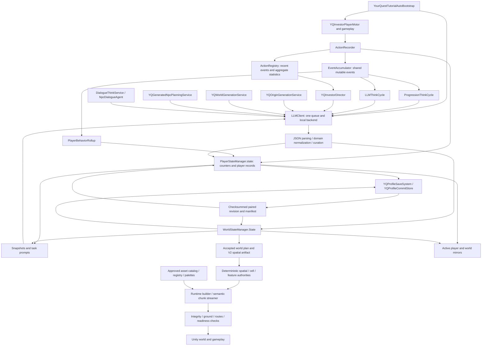
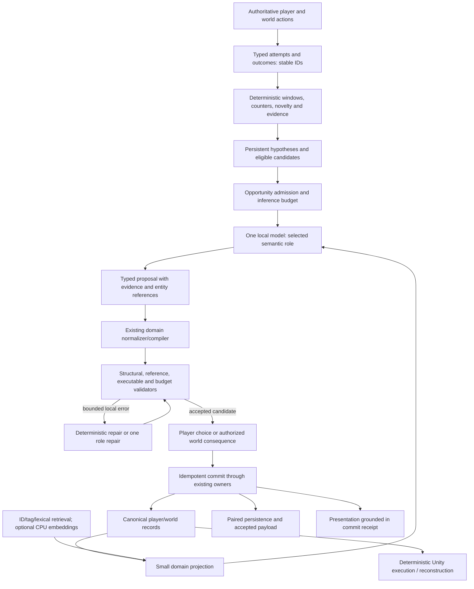

# YourQuest LLM runtime architecture audit

**Decision: REFINE. Keep one local generative model, specialize its calls, and finish the deterministic evidence, mechanic, validation, and persistence boundaries. Do not add miniature generative agents now.**

Audit date: September 27–28, 2026. Repository: `C:/Users/Garri/YourQuest`, HEAD `a692190af046f2950507b98e80b74914825fc22d`, including the existing uncommitted working tree. This is an architecture assessment and migration proposal, not a beta certification. No production code, assets, scenes, saves, model configuration, or roadmap files were modified.

Evidence labels used throughout: **source** means inspected current implementation; **experiment** means an isolated executed check; **estimate** means explicitly assumed arithmetic; **proposal** means recommended future behavior. Historical receipts are not fresh runtime results. Model throughput, in-game frame times, failure rates, and 500-hour play were not measured. The report supplies a reproducible benchmark design rather than inventing those results.

## 1 — Executive finding

YourQuest already uses much of the right architecture. Several gameplay services submit different prompts to one `LLMClient`, which serializes work against a configured local model. Generated world meaning becomes structured records; deterministic compilers and approved asset binders turn those records into terrain, roads, sites, and streamed cells. Player and world documents, rather than model conversations, are intended to own persistent reality.

The current implementation is consequently close to **C in inference deployment**—one model with role-specific calls—and **E in world construction**—semantic decisions followed by deterministic tools. It is not yet a complete semantic compiler for player adaptation. Repeated behavior can produce generated names and offers without a sufficiently faithful, durable chain from evidence to supported executable mechanic.

The most consequential findings are:

1. **Behavior is lost or distorted before interpretation.** Multiple consumers clear the shared event accumulator after asynchronous work. Events lack durable target/tool/outcome semantics. Aggregate counts cannot reliably distinguish trying to harvest a tree from incidental attacks, or repeated failure from unrelated repetition.
2. **A generated skill is not reliably an executable contract.** The ordinary skill-offer acceptance path does not copy several existing mechanical fields. Combat still uses name/description-derived descriptors and a generic projectile/pulse branch. A self/buff intention can fall through to damaging pulse behavior. This violates the required separation between prose and mechanics.
3. **Some valid-looking model outputs cannot be accepted.** The director's quest prompt omits the objective record required by quest acceptance. Conversely, merely naming a supported objective does not prove its target exists or is reachable.
4. **Scheduling safety is broader than semantic dependency.** Requests bind to complete player/world revisions by default; routine movement increments the player revision. A useful multi-second response can therefore be rejected during ordinary play. Independent timers also compete for the same evidence and GPU.
5. **Memory is bounded largely by omission, not selective durable understanding.** Recent dialogue and ledgers have caps, but older meaningful facts are not consistently promoted into retrievable structured memory. Save collections and full-document writes can still grow even while prompts remain capped.

These problems would survive a switch to five smaller models. Additional models would introduce weights, cache allocations, loading delays, evaluation surfaces, and synchronization without adding the missing executors or state contracts.

**Recommended architecture:** one approximately 4B local semantic model, isolated role prompts and small output schemas, existing deterministic world/gameplay authorities, one logical opportunity-admission policy, structured persistent evidence and content, selective retrieval, executable validation, and bounded local repair. Start retrieval with stable IDs, tags, and lexical search. Add a small CPU embedding model only if retrieval evaluation demonstrates a material gain. A 0.5B–1.7B generative specialist or a 7B–9B director remains a benchmark challenger, not a required dependency.

“Central director” means coherent semantic opportunity selection and generation budgets, not an LLM that runs combat, simulates every NPC, owns saves, or coordinates natural-language conversations among agents. Preserve the existing scheduler and state owners.

The smallest next action is a focused G03/G15 correction: introduce submitted event-window identity and independent acknowledgement, then replace broad revision rejection with dependency-aware validation while preserving profile/world/epoch cancellation. Pair that with an end-to-end G09/G16 ability-contract test. Do not start a model migration before those boundaries are trustworthy.

## 2 — Current architecture

### Actual runtime map

The diagram shows current flows, not uniform enforcement. The generic proposal boundary exists, but NPC planning, background lore, and several director mutations do not all use the same acceptance/receipt path. An active mirror write is not equivalent to publishing a paired profile revision.

Production bootstrap explicitly installs the progression/world/director services, removes the older tutorial LLM orchestrator, and retains the authoritative investor motor. Current source allows initially empty NPC population and generates it after reveal; the supplied older description requiring all NPCs before reveal is stale. Current player/world schema is **7**, not the supplied baseline's 6. Continuous contracts remain `continuous_world_cell_v5|continuous_edge_v3`. See [bootstrap](C:/Users/Garri/YourQuest/Assets/Assets/Scripts/Tutorial/YourQuestTutorialAutoBootstrap.cs:330), [state version](C:/Users/Garri/YourQuest/Assets/Assets/Scripts/Data/State/YQStateFoundation.cs:183), and [runtime builder](C:/Users/Garri/YourQuest/Assets/Assets/Scripts/Generated/YQGeneratedWorldRuntimeBuilder.cs:3266).

### Invocation inventory

This inventory covers project-owned runtime invocation sites found through `Submit`, enqueue adapters, typed generation APIs, their callers, and production bootstrap references. Editor utilities and imported packages are not inferred to be runtime architecture. Numbers below are source defaults/overrides, not an Inspector snapshot or measured cadence. A timer is an eligibility check, not a guaranteed model call.

| Caller / role | Production reachability and trigger | Context / output | Request, retry, and failure behavior |
|---|---|---|---|
| `YQOriginGenerationService` | Ordinary origin intake; startup exclusive | Answers, identity seed, common player/world context, compact origin DTO and optional Goddess voice | 650–900 output tokens; 75 s; zero transport retries; origin grammar, domain parsing and bounded structural/optional-tail repairs; questionnaire fallback |
| `YQWorldGenerationService`, initial plan | After committed origin or missing usable authored plan; startup exclusive | Seed, origin, supported site roles/styles, ledger, common snapshots; `world_plan_v1` | Exactly 3 regions, 2 settlements, 2 camps; 1,800–2,200 output; 60 s; zero retries; grammar, normalization, counts/identity checks; deterministic scaffold on generation failure |
| Same service, background lore | Default 1,800 s, busy deferral 60 s | Existing canon/locations/origin/ledger; canon lines, POIs, hooks, objects | 700 output; 120 s; JSON mode, no explicit per-call grammar; direct domain application and mirror save |
| `YQGeneratedNpcPlanningService` | At least 8 s after reveal; first settlement and first camp | Location/region/world, roles, reserved names; exact-count NPC batch | Default output ceiling 1,800; 95 s request; 2 attempts/location, 12 s delay, 180 s watchdog; legacy enqueue adapter; seeded fallback; development fixture bypasses live model |
| `DialogueThinkService` | Player dialogue via `NpcDialogueAgent` | Public persona, current objective/situation, world rationale, last 12 lines, player utterance | 96 output; repair 72; default 2 malformed-reply repairs (configurable up to 3); no explicit per-call grammar; generic request timeout applies; in-character fallback |
| `ProgressionThinkCycle` | Fallback bootstrap interval 14 s; significance/eligibility/idle gates | Snapshot, recent bounded events, behavior summary, progression scores, existing names; one typed content decision | 420 output; 40 s; zero transport retries; JSON without explicit schema; failure backoff up to 120 s; curation/applier; clears shared events on applied result |
| `LLMThinkCycle` | Bootstrap 18 s, significance 5, idle gating, delayed 90 s after reveal | Common snapshots, situation, recent summary, ledger; world delta | 600 output/45 s; one repair 500/40 s; zero transport retries on these calls; deterministic fallback delta; shared accumulator clear |
| `YQInvestorDirector` | Timed small/major opportunities (90/420 s), notable events with cooldown, explicit requests | Common snapshots, event evidence, Goddess persona, recent voice/journey; quest/title/class/item/lore/world/player-event decisions | Uses StructuredState profile (900 output by default), generic timeout/retry policy unless overridden; pending-tag deduplication; several direct mutation/offer paths; presentation voice extracted from same result |
| `DirectorThinkCycle` | Compatibility component, no demonstrated production bootstrap/serialized reference in inspected production scenes/resources | Generic director context/delta, interval 18 s | Legacy enqueue; do not count it as another proven active production loop |
| `DebugSkillGenerator` | Debug/context-menu/trigger component; no demonstrated production scene wiring | Skill seed type/context/environment | Typed `GenerateSkill` adapter; debug responsibility, not production mechanic generation proof |
| `YourQuestTutorialLLMOrchestrator` | Legacy tutorial; production bootstrap explicitly removes it | World/event/title/class/quest/skill requests | Typed submissions; retained compatibility source, not simultaneous production owner |
| `YQPrototypeTutorialDirector` | Prototype path, no demonstrated production bootstrap | Player/world snapshots and last 12 ledger entries | Legacy enqueue; not grounds to replace current director |

`PlayerController` contains a client reference but is not another semantic generator in the inspected path. The runtime builder uses exclusive-sequence coordination; it is not a separate model. A summarization category exists in configuration, but no active LLM summarization caller or embedding inference path was established. `EventSummarizer` is deterministic counting.

Source anchors: [origin request](C:/Users/Garri/YourQuest/Assets/Assets/Scripts/Generated/YQOriginGenerationService.cs:61), [world requests](C:/Users/Garri/YourQuest/Assets/Assets/Scripts/Generated/YQWorldGenerationService.cs:337), [NPC request](C:/Users/Garri/YourQuest/Assets/Assets/Scripts/Generated/YQGeneratedNpcPlanningService.cs:1310), [dialogue](C:/Users/Garri/YourQuest/Assets/Assets/Scripts/Dialogue/DialogueThinkService.cs:84), [progression](C:/Users/Garri/YourQuest/Assets/Assets/Scripts/ProgressionThinkCycle.cs:103), [world thinking](C:/Users/Garri/YourQuest/Assets/Assets/Scripts/Gameplay/Systems/World/LLMThinkCycle.cs:192), [director](C:/Users/Garri/YourQuest/Assets/Assets/Scripts/Tutorial/YQInvestorDirector.cs:284).

### Shared inference machinery

The default configuration selects llama.cpp and `Qwen3.5-4B-Q4_K_M.gguf`, 12,288 total context tokens, one slot, a 30,000-character prompt ceiling, a 256-token safety allowance, batch 128/microbatch 32, and up to four inference CPU workers while reserving four cores. It requests approximately 3,072 MiB device headroom and unloads an owned idle server after 45 seconds. These are policies, not measurements of actual allocations. Category defaults include Dialogue 128, Goddess voice 260, Origin 1,000, World 3,000, NPC 2,600, Quest 1,800, StructuredState 900, and Summary 700 output tokens; caller overrides above take precedence. [Configuration](C:/Users/Garri/YourQuest/Assets/Assets/Scripts/LLM/LLMRuntimeConfig.cs)

`LLMClient` has startup-exclusive, high-priority, and normal queues, capacity 24, request aging, terminal outcomes, lifecycle binding, and an exclusive lease. It executes one coroutine request at a time. Player priority affects the next selection; it does not preempt an already-running background request. Requests are nonstreaming. The OpenAI-compatible body contains one user message combining instructions and context; there is no independently protected system-message context layer in this builder. JSON mode and supplied schemas constrain output formatting. Responsiveness settings disable prompt caching; actual flags are checked against the installed server's supported help. [Queue](C:/Users/Garri/YourQuest/Assets/Assets/Scripts/LLM/LLMClient.cs:725), [request body](C:/Users/Garri/YourQuest/Assets/Assets/Scripts/LLM/LLMClient.cs:1268), [server policy](C:/Users/Garri/YourQuest/Assets/Assets/Scripts/LLM/LlamaCppServerProcess.cs:277)

### Canonical ownership and disagreement risks

| Information | Creator / authorized writer | Canonical owner and storage | Consumers | Determinism, replay, disagreement |
|---|---|---|---|---|
| Player identity, inventory, equipped content, counters | Origin, gameplay transactions, progression acceptance | `PlayerStateManager.state`; paired player document | Combat/UI/quests/prompts | Accepted payload saved; model output not reproducible merely from seed. Compatibility `PlayerProfile` must remain a view, not another authority |
| Raw actions | Authoritative gameplay through recorder | Registry/accumulator in memory | Progression/world/rollup/director | Not durable semantic history; runtime instance ID is not persistent identity; consumers can erase each other's evidence |
| Behavior summaries | Rollup and immediate counters | Player ledger/counters | Prompts and progression scoring | Counts durable; context and rare events can be lost; multiple summaries can disagree in interpretation |
| World identity and lore | World service and accepted domain mutations | `WorldState.generatedWorldPlan`, canon/locations/factions | Compilers, NPCs, prompts, quests | Save accepted output; additive prompt wording alone does not prevent overwrites |
| Spatial V2 plan | Deterministic spatial compilers and validator | Accepted version/hash inside world plan | Materializer and continuation authorities | Reproducible for accepted input/version; V1 compatibility is separate authority, not mixed geometry |
| Untouched remote cells | Cell/semantic/feature authorities | Accepted seed/graph plus bounded caches | Streamer | Order-independent derivation; cache is disposable |
| Named sites and world changes | Validated feature mutation writer | Persistent semantic records/overlays/receipts | Reconstruction and current scene | Must survive unload and migration; cannot be regenerated as untouched terrain |
| NPC identity | NPC planner | `generatedNpcs` | Population builder, dialogue persona | Saved identity; current incomplete-coverage restart can clear valid accepted identities |
| NPC status, affinity, knowledge | Gameplay/social owners | `WorldState.npcs` and profile-scoped stores | Dialogue/quests/factions | Plan versus mutable projection needs explicit field ownership; original plan cannot recreate lived relationships |
| Dialogue | Player and dialogue service | Profile-scoped session store | Recent dialogue context | Bounded transcript; separate memory-store types do not prove active fact extraction |
| Approved visual bindings | Catalog/binder, authored ScriptableObjects | Palettes and runtime registry references | Materializer/equipment/presentation | Stable asset selection; GUIDs/materials preserved; generated text cannot supply arbitrary asset paths |
| Saved revision | Profile save coordinator / commit store | Staged checksummed player/world/auxiliary revision plus manifest | Load/recovery | Atomic pair authority; active mirrors can be newer than published revision |

### Representative end-to-end traces

**Adaptive skill:** motor/combat action → recorder sends to registry and accumulator and increments player counters → progression summarizes recent events and aggregate behavior → model returns a skill seed → `ProgressionDecisionApplier` checks confidence/evidence/novelty → pending offer → `PlayerState.AcceptSkillOffer` creates a saved skill → equipment/combat consumes it. The trace breaks semantically at insufficient target/outcome evidence and incomplete mechanic-field transfer. Reload preserves the accepted record; it does not repair omitted mechanics. [Acceptance](<C:/Users/Garri/YourQuest/Assets/Assets/Scripts/Data/State/Player State/PlayerState.cs:1175>)

**Quest:** progression's richer output may include an explicit objective → acceptance builds supported objective records → `YQQuestCompletionDirector` evaluates IDs/counters every approximately 0.5 s → reward/completion guard → save. The investor director's quest schema instead requests prose without the objective, so its ordinary output fails the acceptance contract. Completion is correctly based on structured objectives, while reward calculation still contains prose-keyword influences. [Objective construction](<C:/Users/Garri/YourQuest/Assets/Assets/Scripts/Data/State/Player State/PlayerState.cs:1019>), [quest producer](C:/Users/Garri/YourQuest/Assets/Assets/Scripts/Tutorial/YQInvestorDirector.cs:227)

**World:** questionnaire/origin → world semantic response → parsing/normalization/identity checks → accepted world record → deterministic geology/hydrology/sites/routes → canonical sort/hash/validation → frozen V2 selection → approved palette binding/materialization → physical readiness → paired save at reveal. Reload reuses accepted meaning and spatial authority. Untouched remote geography derives from the same accepted inputs; a new model response is not part of replay. [Compiler](C:/Users/Garri/YourQuest/Assets/Assets/Scripts/Generated/YQSpatialBlueprintCompilerV2.cs:44)

**NPC/dialogue:** accepted location → batch planner → pending NPC list → coverage acceptance → saved plan plus mutable NPC projection → scene NPC → player utterance saved → last 12 transcript lines plus public persona sent to model → reply validation/repair → session store. Profile and nonce guards prevent late replies crossing conversations. The stored 160-line default transcript is larger than the prompt window but does not constitute durable semantic memory of older promises.

**World mutation:** accepted feature-overlay command → schema/key/revision/idempotency checks → canonical overlay and receipt → loaded view update → full world mirror save → later paired profile save → overlay replay during reconstruction. Migration must preserve overlays when rebuilding semantic authority. [Overlay commit](C:/Users/Garri/YourQuest/Assets/Assets/Scripts/Generated/YQPlayerFollowingSemanticChunkStreamer.cs:3178)

## 3 — Current problems, ranked by architectural impact

| Priority | Finding and evidence strength | Consequence | Smallest architectural response |
|---|---|---|---|
| P0 | **Incomplete executable skill contract — source.** Offer acceptance omits existing targeting/resource/cooldown/VFX/animation fields; combat derives a descriptor from prose and defaults to projectile/pulse behavior | Generated identity can promise an unsupported effect; self/buff semantics can execute damage | One supported ability contract through offer→accept→save→equip→execute, validated against existing executor capabilities |
| P0 | **Shared asynchronous event clearing — source.** Both progression and world thinking can clear all accumulated events, including later arrivals | False negatives, nondeterministic evidence ownership, missed rare experimentation | Immutable submitted window, stable event IDs, independent consumer cursors, bounded acknowledged retention |
| P0 | **Overbroad stale-result binding — source conditional consequence.** Request defaults bind entire player/world revision; counter increments call `Touch`; movement records repeatedly | Normal gameplay can invalidate every sufficiently slow request; faster tiny models would only mask it | Preserve lifecycle guards; validate referenced entities/candidate versions and evidence windows; revalidate preconditions at commit |
| P1 | **Quest producer/consumer mismatch — source.** Director schema has no objective; acceptance requires one | Paid inference produces an unusable offer | Reuse existing supported objective schema, validate targets and feasibility before offering |
| P1 | **Behavior interpretation is semantically thin — source.** Event includes target name/instance ID but no stable target, tool, affordance, outcome, or failure reason; eligibility relies partly on candidate text keywords and lifetime counters | One activity can imply unrelated intent; meaningful novelty can be invisible | Typed attempts/outcomes and provenance-backed hypotheses; allow abstention and alternatives |
| P1 | **Critical context can be discarded — experiment.** Default 30,000-character cap drops a marked objective from the middle of a 46,074-character prompt while returning success | Output can be syntactically correct and contextually wrong | Budget structured projections before rendering; required facts/schema are indivisible; fail/defer when required context cannot fit |
| P1 | **Accepted content and transactional boundaries are inconsistent — source.** Invalid NPC coverage clears whole accepted list; background lore mutates directly; successful director callback can publish voice even when domain action rejects | Identity churn, misleading narration, partial or stale consequences | Fill missing NPC slots, preserve accepted records, domain commit result/receipt controls presentation |
| P1 | **Paired-save freshness gap — source.** Many mutations save only active mirrors; inspected paired-save callers are explicit UI/startup/quit paths, not a demonstrated periodic paired autosave | Crash can recover an older consistent revision despite newer mirror writes | One dirty-state publication policy through existing profile owner; test crash boundaries; do not equate atomicity with freshness |
| P1 | **Full-world serialization and retained history — source risk, not measured hitch.** Streamer yields one frame then synchronously writes full world; paired revisions retain full snapshots, no general pruning found | Frame and disk cost can grow independently of inference context | Measure serialization/write cost; coalesce publication, version retention, eventually partition only when measurements justify it |
| P2 | **Redundant context and competing opportunity producers — source.** Common builder always inserts world/player snapshots; three loops overlap; global “NPC region” filtering is effectively unfinished | More prefill, unrelated facts, duplicate opportunities | Domain projections and one logical admission policy in existing services |
| P2 | **Long-term facts are forgotten while storage grows — source.** Recent caps, no observed active semantic fact store, growing meaningful world records | Bounded prompts with poor continuity, or arbitrary truncation | Structured facts with provenance and knowledge scope; selective retrieval |
| P2 | **Generated identity replaced by fixed content in some normal paths — source.** Six stillness titles and normal item template names are hardcoded | Stable mechanics but reduced intended personalization | Keep deterministic eligibility/templates; generate and persist names/meaning for eligible content; identifiable fallback |
| P2 | **World enrichment can conflict with physical truth — source risk.** Lore prompt says additive, but location upsert can overwrite ID fields | Narrative locations may imply nonexistent/repositioned places | Referential and immutable-field validation; reserve/materialize before promising reachability |
| P2 | **Semantic authority replacement may lose overlays — unresolved source risk.** Rebuild on fingerprint/version creates new authority; inspected path does not copy old overlays | Potential save migration loss | Focused old-authority→new-hash replay test before any such migration; not a claim of reproduced loss |

P0 denotes threat to the defining adaptive loop, not a claim of a crash reproduced in this audit. The broad architecture is not the root cause of every defect. Several findings are missing or inconsistent implementation of already-planned boundaries.

Further evidence: [events](C:/Users/Garri/YourQuest/Assets/Assets/Scripts/Observation/Models/ActionEvent.cs), [progression clear](C:/Users/Garri/YourQuest/Assets/Assets/Scripts/ProgressionThinkCycle.cs:198), [binding](C:/Users/Garri/YourQuest/Assets/Assets/Scripts/LLM/LLMClient.cs:521), [stale check](C:/Users/Garri/YourQuest/Assets/Assets/Scripts/LLM/LLMClient.cs:1582), [combat](C:/Users/Garri/YourQuest/Assets/Assets/Scripts/Tutorial/YQInvestorCombat.cs:195), [context compiler](C:/Users/Garri/YourQuest/Assets/Assets/Scripts/LLM/LLMContextCompiler.cs:58), [NPC restart](C:/Users/Garri/YourQuest/Assets/Assets/Scripts/Generated/YQGeneratedNpcPlanningService.cs:859), [profile commit](C:/Users/Garri/YourQuest/Assets/Assets/Scripts/Tutorial/YQProfileSaveSystem.cs:265).

### Excessive and insufficient intelligence

There is no evidence that an LLM currently places thousands of trees or computes terrain meshes; do not solve an imaginary problem. Existing deterministic world generation is a strength. Avoid model calls for counts, reward arithmetic, target lookup, supported-objective mapping, collision, route geometry, or known behavior categories.

Conversely, permanent stillness title names and generic item identities are unnecessarily rigid where the product expects generated meaning. The right division is deterministic eligibility, power, and execution with generated identity and contextual significance. More semantic interpretation is justified for ambiguous recurring attempts and evolving relationships, provided the underlying action and relationship systems actually exist.

## 4 — Research comparison

Sources were selected for implementation relevance, not agent count. Each transfer below is an architectural inference. None directly demonstrates YourQuest's complete persistent RPG on a shared 8 GB gaming GPU. Published validity, creativity, or task-success scores are not equivalent to fresh game correctness.

| Source and evidence quality | Approach | YourQuest equivalent / important difference | Adopt / do not adopt |
|---|---|---|---|
| [Agentic Video Generation: From Text to Executable Event Graphs via Tool-Constrained LLM Planning](https://arxiv.org/html/2604.10383v1), 2026, primary preprint | Director, Scene Builder and Relation Subagents operate through programmatic GEST state and constrained construction tools; deterministic execution | Accepted spatial/game records and compiler. Offline story/video construction differs from latency-sensitive persistent play | Adopt executable intermediate state and tool-level constraints. Staged Pydantic-only generation failed its tested executable construction task; tool-constrained success was still imperfect. Do not infer that six agents or large-model offline costs are needed for this game |
| [RPGAgent](https://doi.org/10.1145/3772318.3790326), CHI 2026, primary paper | Narrative, scene, mechanics, code roles share structured JSON and PCG in Unity authoring | Role prompts plus domain records. It generates authoring artifacts/code, not safe continuously evolving player saves | Adopt explicit handoffs and localized correction. The 18-person authoring study supports usability/creative benefits; dependability was not significantly improved. Do not execute generated C# at runtime or attribute gains solely to agent count |
| [Agentic Procedural Content Generation](https://zehua-jiang.github.io/AgenticPCG/), [implementation](https://github.com/JiangZehua/AgenticPCG), 2026, author project and code | LLM uses procedural generators, editing, evaluation and optimization tools for game levels | Existing spatial compilers and validators already offer this separation | Adopt bounded tool interfaces and measurable objective functions. Do not add language-model conversations where a deterministic optimizer can repair a route. No local-gameplay performance transfer established |
| [Adaptive Level Modification via Player Skill Classification and Large Language Models](https://www.nature.com/articles/s41598-026-63084-z), 2026, primary journal paper | XGBoost skill classes condition two-stage level changes, checked with physics/pathfinding and fallback | Behavior evidence→semantic proposal→feasibility gate. Mario skill labels differ from inferring emergent interests | Adopt cheap feature classification and independent feasibility. Reported 97.82% classification does not measure intent recognition; chunk/full-level playability differs, so validation is not universal success. Do not generalize three skill classes to all player goals |
| [Narrative-to-Scene Generation](https://arxiv.org/html/2509.04481v2), 2025, primary preprint | Symbolic object relations, GameTileNet affordance metadata, semantic asset retrieval, cellular-automata terrain and placement | Semantic tags/palettes and deterministic binders. Small 2D story-scene evaluation differs from continuous 3D persistence | Adopt affordance-aware retrieval and spatial relations. Its MiniLM retrieval illustrates that an embedding model need not approach 1B parameters. Do not replace approved Unity bindings with unconstrained text-to-asset choice |
| [Agent2World](https://arxiv.org/html/2512.22336v1), 2025, primary preprint | Researcher/model-developer/testing decomposition produces executable symbolic world models with unit and simulation feedback | Domain validators and repair contracts. Learning world dynamics/PDDL/code differs from using known Unity mechanics | Adopt executable counterexamples and precise failing constraints. Do not import its full research team or runtime code generation; model self-review is not a physics test |
| [Player Modeling and Large Language Models: An Interaction-Based Approach](https://sbgames.org/sbgames2025/computation/), SBGames 2025; [author institution](https://inf.ufg.br/n/195265-ciencia-e-criatividade-jogando-lado-a-lado?atr=en&locale=en) | Primary institutional/program material confirms the paper and its player-modeling topic | Directly relevant to telemetry-driven adaptation, but full paper/implementation could not be retrieved through the publisher during this audit | Investigated, with **limited evidence**: no claims about its compression architecture, measured accuracy, or local costs are used. Secondary abstract scores are excluded from the decision. This source does not establish YourQuest's persistent evidence design |
| [From Gameplay Traces to Game Mechanics](https://arxiv.org/html/2602.00190v1), 2026, primary preprint | Structured causal-model intermediate representation between traces and executable game descriptions | Evidence/intent/mechanic boundary; benchmark concerns recovering existing mechanics in GVGAI | Adopt explicit causal hypotheses and compare against direct generation. Do not treat subjective mechanic similarity as proof that newly composed Unity effects are safe |
| [CreativeGame](https://arxiv.org/html/2604.19926v1), 2026, primary preprint | Explicit mechanic planning, runtime checking, proxy rewards and lineage memory for generated games | Capability-limited mechanic proposals and regression lineage | Adopt executable quality checks and provenance of revisions. Whole HTML5 game generation differs from preserving one long-lived RPG save; proxy novelty is not player enjoyment |
| [GITM](https://arxiv.org/abs/2305.17144), [author repository](https://github.com/OpenGVLab/GITM), 2023, primary research | Hierarchical goals/plans and reusable knowledge for Minecraft actions | Semantic planning above existing executors | Adopt planner/executor boundary; do not infer separate small models. Inspected repository is not a complete code-verification basis; agent plays an existing world rather than inventing persistent mechanics |
| [JARVIS-1](https://arxiv.org/abs/2311.05997), [release](https://github.com/CraftJarvis/JARVIS-1), 2023, primary research/partial implementation | Multimodal planner, memory, goal-conditioned controller | Retrieved experience and bounded domain actions | Adopt relevant memory. Released fixed-memory offline evaluation omits parts of growing-memory/self-check behavior; cloud setup and pixel controller are not an 8 GB Unity design |
| [AgentSociety](https://arxiv.org/abs/2502.08691), 2025, primary research; [Tsinghua overview](https://lcg.tsinghua.edu.cn/info/1026/2160.htm), official lab material | LLM agents embedded in social environment and simulation engine | NPC/world state and social opportunities | Adopt inspectable state and empirical validation. Hosted large-scale simulation does not justify continuous model calls for every RPG NPC |
| [GenerativeAgentsCN](https://github.com/x-glacier/GenerativeAgentsCN), pinned code discussed below, independent implementation/community experiment | Shared local language-model configuration plus separate embedding and persistent memory | One model with roles and optional retrieval | Adopt inspectable memory/provider separation. Do not copy serial offline timing, permissive parsing fallback, or unbounded retrieval work |
| [NetEase Fuxi engineering account](https://fuxi.netease.com/database/2711), 2025, official industry material | Distillation/post-training and structured NPC decision/dialogue consistency | Narrow future classifier or NPC role tuning | Adopt decision-before-dialogue grounding and domain error datasets. Exact model sizes, hardware and latency are undisclosed; not evidence for off-the-shelf tiny-agent superiority |
| [Tencent GDC engineering overview](https://www.tencent.com/tencent-games-shares-insights-and-technologies-at-gdc-2024/), 2024, official industry material | GiiNEX content generation alongside decision/simulation tools | Content pipeline and deterministic runtime ownership | Useful scope distinction, insufficient published detail for model routing, memory, validation or consumer-local claims |

Recent video-world-model work such as [WorldMind](https://arxiv.org/abs/2608.21439) and Tencent's [Hunyuan-GameCraft](https://arxiv.org/abs/2506.17201) was screened as adjacent research. Rendered interactive video is not an inventory, collision, quest, or save authority. It offers no reason to replace YourQuest's deterministic Unity world.

The common transferable result is **structured state plus external verification**, not “more agents.” Research is strongest where a proposal can be executed and independently tested. Evidence for robust long-lived semantic memory and real-time shared-GPU RPG deployment is much weaker.

## 5 — Chinese research findings

### Search scope and evidence limits

Dedicated English and Simplified Chinese searches covered 大语言模型游戏, 游戏智能体, 生成式智能体, 多智能体世界模拟, 程序化内容生成, 游戏世界生成, NPC记忆, 玩家建模, 自适应游戏, 游戏任务/剧情生成, 端侧/本地大模型, 小参数模型, 分层智能体, 模型路由, 智能体编排, 结构化输出 and Minecraft agents, combined with the requested university/lab/company names.

Searches covered Tsinghua, PKU, Zhejiang, SJTU, USTC, CAS, BAAI, Tencent/Tencent Games/AI Lab, NetEase/Fuxi, miHoYo, ByteDance, Alibaba/Qwen, Huawei, ModelScope and DeepSeek; GitHub, Gitee, accessible conference/lab material, engineering blogs and attributable presentations. Positive architectural evidence is reported below. CNKI did not provide accessible inspectable task-specific primary material in this pass; a Gitee mirror was not treated as independent corroboration. Searches of several companies returned promotion, community reposts, or insufficient deployment detail. That is a disclosure/search limitation, not evidence that those organizations lack relevant work.

A Tencent Cloud community article is not automatically Tencent engineering evidence. Likewise, a BAAI-hosted repost is not necessarily BAAI primary research. Evidence classes remain separate: primary research, official university/lab material, industry engineering material, open-source implementation, secondary analysis, and community experiment. Secondary material was used for discovery, not to establish the central decision.

### Translated technical findings

**NetEase Fuxi, original Chinese read:** the official account describes “大模型蒸馏小模型+后训练”—large-to-small model distillation plus post-training—to address deployment cost and performance. It describes intent recognition, dispatch, decision generation and dialogue; gameplay-balanced training examples and bad-case iteration; and training against “言行不一,” disagreement between what an NPC says and does. Combat commands become fields consumed by combat modules; “记忆感知” concerns extracting salient player moments. These are source claims. **Our inference:** small models become credible after domain training and consistency evaluation, not just because their parameter count is small. Condition speech on an accepted action receipt. No model size, local 8 GB residency, or reproducible latency was disclosed. [Official account, October 11, 2025](https://fuxi.netease.com/database/2711)

**GenerativeAgentsCN, original Chinese read:** the January 15, 2026 update explicitly says default language/embedding models changed to Qwen3 4B Instruct-2507 and Qwen3 Embedding 0.6B to reduce VRAM use and improve inference speed. Pydantic replaced regex parsing. This is a maintainer rationale, not a controlled size-selection study. Example simulations used 32B and dialogue screenshots used 14B, so they cannot certify default-4B quality. [Pinned README](https://github.com/x-glacier/GenerativeAgentsCN/blob/37b5584f94db83b598b27fee55b5d408a0e5c5fd/README.md)

**Tsinghua laboratory material:** the Chinese AgentSociety overview emphasizes development, verification and application of social simulation. It supports treating virtual-society behavior as something to validate, not assuming realism because many agents run. Hosted-model resources in related challenge material do not establish consumer-local feasibility. [Lab overview](https://lcg.tsinghua.edu.cn/info/1026/2160.htm), [challenge](https://www.ee.tsinghua.edu.cn/info/1076/5354.htm)

### GenerativeAgentsCN: inspected code, not README inference

Pinned commit: `37b5584f94db83b598b27fee55b5d408a0e5c5fd`. Independent open-source/community evidence; no runtime reproduction performed.

| Inspected component | Actual behavior | Transfer to YourQuest |
|---|---|---|
| [Configuration](https://github.com/x-glacier/GenerativeAgentsCN/blob/37b5584f94db83b598b27fee55b5d408a0e5c5fd/generative_agents/data/config.json) | One configured `qwen3:4b-instruct-2507-q4_K_M` language model through local Ollama compatibility API; one `qwen3-embedding:0.6b-q8_0` model | Many simulated agents do not mean many resident generative models |
| [Provider](https://github.com/x-glacier/GenerativeAgentsCN/blob/37b5584f94db83b598b27fee55b5d408a0e5c5fd/generative_agents/modules/model/llm_model.py) | Pydantic-derived strict-schema request, synchronous HTTP, 300 s timeout, exception retries; parse/schema failure can return raw text | Reuse typed contracts conceptually; do not copy permissive failure semantics or blocking retry loops |
| [Agent](https://github.com/x-glacier/GenerativeAgentsCN/blob/37b5584f94db83b598b27fee55b5d408a0e5c5fd/generative_agents/modules/agent.py) | Planning, reaction, chat, importance and reflection select prompt/schema roles on the same configured model | Supports C, not proof of D; movement/pathfinding remains conventional code |
| [Associative memory](https://github.com/x-glacier/GenerativeAgentsCN/blob/37b5584f94db83b598b27fee55b5d408a0e5c5fd/generative_agents/modules/memory/associate.py) | Event/thought/chat nodes, recency/relevance/importance ranking; retrieval asks for all eligible nodes before reranking; default memory limit is unlimited | Persist and retrieve facts; globally bound retrieval work as well as returned prompt size; preserve provenance |
| [Storage](https://github.com/x-glacier/GenerativeAgentsCN/blob/37b5584f94db83b598b27fee55b5d408a0e5c5fd/generative_agents/modules/storage/index.py) | Persistent LlamaIndex/index/docstore and Ollama embeddings; retrieval errors can return empty results | Memory is software state, not an implicit model faculty; distinguish no relevant fact from retrieval failure |
| [Prompt roles](https://github.com/x-glacier/GenerativeAgentsCN/blob/37b5584f94db83b598b27fee55b5d408a0e5c5fd/generative_agents/modules/prompt/scratch.py) | Bounded counts of retrieved memories, relation/dialogue summaries, explicit response types; some numeric bounds only described in text | Count caps are not token budgets; use executable ranges and required-fact preservation |
| [Simulation loop](https://github.com/x-glacier/GenerativeAgentsCN/blob/37b5584f94db83b598b27fee55b5d408a0e5c5fd/generative_agents/start.py) | Steps and agents run sequentially, state/checkpoints saved, simulated time advances, output later replayed | Does not demonstrate interactive RPG latency, 60 fps, or 500-hour scalability |

### Small models and local inference

| Family / primary source | Relevant sizes | Decision-relevant interpretation |
|---|---|---|
| [Qwen2.5](https://qwenlm.github.io/blog/qwen2.5/) | 0.5B, 1.5B, 3B, 7B | Plausible extraction/classification baselines; no proof of mechanic-design sufficiency |
| [Qwen3 Chinese release](https://qwenlm.github.io/zh/blog/qwen3/) | 0.6B, 1.7B, 4B, 8B | Role prompting/nonthinking modes and local deployment candidates; distinguish 1.7B from older 1.5B |
| [DeepSeek-R1 release](https://github.com/deepseek-ai/DeepSeek-R1) | Distill-Qwen 1.5B/7B, Distill-Llama 8B | Distilled reasoning is real, but long thought generation is not automatically a fast constrained JSON specialist |
| [Qwen3.5-4B](https://huggingface.co/Qwen/Qwen3.5-4B), [9B](https://huggingface.co/Qwen/Qwen3.5-9B) | 4B/9B; smaller family variants also exist | Current baseline candidate; hybrid recurrent/attention architecture changes cache arithmetic. Evaluate exact quantization/nonthinking mode, not model-card aggregate scores |
| [Qwen3 Embedding](https://github.com/QwenLM/Qwen3-Embedding), [0.6B card](https://huggingface.co/Qwen/Qwen3-Embedding-0.6B) | 0.6B embedding/reranking candidates | Useful multilingual similarity; embedding similarity is neither truth nor intent confidence. A reranker is another inference cost |

Rules over normalized event categories should precede generative classifiers. A compact trained classifier or small encoder can precede a 0.6B embedding model. LoRA changes behavior while retaining base-model compute and adds data/version/evaluation costs; it is not a free speed optimization. No inspected evidence justifies one adapter or weight set per YourQuest domain now.

### International versus Chinese-source findings

This compares the surveyed evidence, not cultures or national engineering styles.

| Dimension | Observed international examples | Observed Chinese-language / affiliated examples | YourQuest implication |
|---|---|---|---|
| Large models and role hierarchy | Video/RPG authoring uses decomposed planning and structured tools | Minecraft agents also separate planner/controller; Fuxi describes large-to-small training | Logical hierarchy does not imply separate resident models |
| PCG / world representations | AgenticPCG and Narrative-to-Scene expose algorithms and symbolic relations | Video-world-model papers and social simulations solve different state problems | Keep engine-owned terrain, mechanics and saves |
| Semantic assets | Affordance metadata and embedding retrieval are explicit | Industry material discusses broader content tools, often without runtime binding details | Preserve approved catalog; test retrieval over its metadata |
| Retrieval / persistent simulation | Experience memory and symbolic state recur, with limited long-session proof | GenerativeAgentsCN exposes deployable local memory code and its scaling compromises | Adopt bounded fact retrieval, not unlimited transcripts or all-node reranking |
| Local versus cloud | Many research comparisons are authoring/cloud workloads | Local Qwen/Ollama prototype is unusually inspectable; industry exact residency remains undisclosed | Stronger practical deployment lead, not an 8 GB performance certificate |
| Fine-tuning / small models | Role prompts often dominate surveyed authoring systems | Fuxi explicitly reports distillation and action/dialogue consistency post-training | Collect real task failures before funding a specialist |
| Validation and routing | Executable tests beat model review | Strict schemas coexist with permissive fallback in community code; industry stresses consistency | Enforce failure boundaries in YourQuest regardless of source reputation |

The distinctive useful additions from the Chinese search are the inspectable **4B plus embedding deployment**, the costs hidden by offline replay, and **domain-trained decision/dialogue consistency**. None requires a generative-agent swarm.

## 6 — Architecture options

The options overlap: current A already contains C/E characteristics. The comparison below is analytical, not a measured league table. Quality means useful, accepted game decisions; speed means time to valid output while preserving frame time.

| Option | Quality / reliability | Latency / tokens / VRAM | Complexity / scalability / maintainability | Decision |
|---|---|---|---|---|
| **A: current substantially unchanged** | Strong world compiler; inconsistent evidence, mechanics and commits constrain adaptation | One model; redundant snapshots, retries, stale rejection and possible cold starts | Lowest immediate change; existing loss/growth defects remain | Reject “unchanged”; preserve owners and working subsystems |
| **B: one general-purpose prompt/model** | Broad context may help isolated coherence, but mixes unrelated contracts and authority | One weight set; large prompts and output unions; difficult required-fact selection | Simple deployment, harder prompts/validation as domains grow | Too coarse as a universal call; useful as a benchmark baseline |
| **C: same model, role-specific passes** | Domain schemas/context improve isolation; extra sequential passes can compound errors | No extra weights; can reduce per-call context; unnecessary chains increase total tokens | Modest incremental change; easy per-role evaluation | Keep as inference organization; do not force every decision through several passes |
| **D: director plus small generative specialists** | Can win on narrow trained tasks; weak specialists may discard rare evidence or poison downstream state | Extra weights/KV or swaps; lower parameter count is not lower time-to-valid | More model versions, prompts, evaluation sets and lifecycle cases | No default adoption; admit one specialist only after measured superiority |
| **Director plus embeddings/classifiers** | Retrieval improves old-fact recall; rules/classifiers handle known categories; wrong-entity retrieval is a new failure mode | CPU encoder can preserve VRAM; vector/index cost grows with retained facts | Moderate additional data/index lifecycle; rebuildable derived index | Conditional addition after ID/tag/lexical baseline |
| **E: director plus mostly deterministic tools** | Strong guarantees within declared capabilities; semantic meaning remains model-generated | Fewer model calls, compact contexts, cheap executable checks; content breadth limited by executors | Closest to current world architecture and existing roadmap | Recommended core |
| **F: hybrid C + E, selective retrieval** | One semantic model; existing domain compilers/validators; evidence-driven opportunities | One active generation slot; explicit time/context budgets; optional CPU embedding | Smallest coherent extension; no competing state or scheduler | **Recommended final architecture** |

Specialization belongs at different layers. Terrain, ecology density, rivers and roads need deterministic algorithm/tool specialization. NPC, quest, item and lore generation can safely share weights while receiving different contexts and schemas. Behavior categorization usually needs rules; ambiguous player intent needs semantic interpretation. Asset matching often needs filtering/retrieval. “Agent” is not an implementation requirement at any of these boundaries.

## 7 — Final proposed architecture

**Director:** interpret ambiguous evidence, compare plausible interests, choose whether/when a supported opportunity would be meaningful, select its domain and semantic identity, and maintain pacing/novelty. It may abstain or incubate. It does not decide numerical damage, perform pathfinding, write save files, or override accepted canon. Integrate admission into the existing progression/director services and `LLMClient`; do not create another scheduler singleton.

**Small generative models:** none required initially. A future narrow extractor/classifier must beat rules and the same 4B role pass including repair, swaps and abstention. It must not independently invent canonical content or “verify” another model's output.

**Embeddings:** optional similarity ranking over bounded, authorized fact/content metadata. Precompute accepted-record embeddings on CPU/idle time; use stable entity and knowledge filters first. Never let similarity substitute for entity identity, chronology, a capability check, or player consent/choice.

**Retrieval:** fetch authoritative facts and supported assets by ID, region, relationship, quest, capability and temporal scope. Rank only eligible facts. Return provenance and current revisions. The index is rebuildable; canonical state is not.

**Deterministic code:** raw event processing, eligibility, novelty/farming budgets, resource costs, power formulas, reward budgets, objective evaluation, physical world construction, approved bindings, movement/combat, NPC immediate reactions, and transaction preconditions.

**Validators:** establish that the proposal is structurally valid, references real entities, uses implemented primitives, fits budgets, is reachable/usable, and can persist/replay. Quality review may rank flavor, but cannot substitute for these checks.

**Persistence:** store accepted content payloads, facts, evidence provenance, candidate/offer lifecycle and mutation receipts through existing player/world/profile authorities. Saves preserve model-authored results; seeded re-inference is never the recovery plan.

**Repair:** fix deterministic formatting/binding issues locally when intent is unchanged. Send a compact failing constraint and affected record to the same model only when semantic choice is needed. Preserve unaffected accepted content. Exhausted repair defers/rejects the candidate and leaves gameplay intact.

### Testing the semantic-compiler hypothesis

The hypothesis is supported strongly for world construction and partly for quests. It needs qualification for player adaptation: a compiler cannot implement a mechanic for which no primitive exists. “Woodcutting” becomes real only if a supported harvesting interaction, target resource state, inventory transaction, feedback and reconstruction contract exist. Generating a new name is not compiling a new capability.

Use a small capability vocabulary based on existing executors, then extend it for each required product behavior. Do not declare dozens of new `*Intent` classes or a universal spell language in advance. Some semantic tasks are direct presentation—dialogue can be generated after selecting facts without a mechanic-design stage. Some world operations require no model at all. The hierarchy is a boundary of responsibility, not a mandatory chain of calls.

## 8 — Model responsibility matrix

Intelligence classes correspond to the requested taxonomy: **A** semantic reasoning; **B** possible specialist; **C** deterministic code; **D** retrieval; **E** classification; **F** embedding similarity; **G** executable validation; **H** cache/precompute. B is a candidate classification, not authorization to deploy another model.

| Task / current owner | Proposed owner and intelligence | Required context / frequency | Output contract | Validator / fallback |
|---|---|---|---|---|
| Origin / origin service | Same service, same model role: A | Questionnaire, supported origin mechanics, identity constraints; once per uncommitted origin | Existing origin DTO | Origin normalizer/capability/assets; explicit origin fallback, preserve accepted origin |
| Initial world identity / world service | Same service A; geometry C/G | Accepted geography constraints, origin, supported semantic styles; once or explicit new semantic region | Existing world-plan records | Identity/count/reference + spatial gates; seeded scaffold |
| Neighboring terrain/chunk / cell and feature authorities | Existing C/H/G; no model | Coordinates, seed, accepted graph/edges; predictive and on demand | Existing cell/edge/feature contracts | Seams/hydrology/ground/routes; retry/backpressure, never invent competing terrain |
| Biome/ecology and palettes / world catalog | C/D/H; A only for new semantic identity | Climate/elevation/water and approved metadata; compile once/query repeatedly | Existing biome/palette records | Asset coverage/density/physical constraints; approved fallback palette |
| Civilization/settlement meaning / world service | Same model A, existing compiler C | Geography, neighboring factions, allowed site roles, historical facts; before visitation | Existing settlement/faction/site semantics | Canon/ID/capability and site traversal; existing accepted site remains |
| NPC identity / NPC planner | Same model A | Location roles, culture, existing names, supported services; bounded batch ahead of need | Existing generated NPC records | Count/uniqueness/reference/binding; identifiable seeded NPC, never overwrite accepted identity |
| Dialogue / dialogue service | Same model A plus D | Public persona, known facts, relationship, current exchange; player initiated | Bounded reply and optional supported command proposal | Known-fact/action whitelist and transaction check; truthful canned acknowledgement/no action |
| Known action classification / recorder/scoring | C/E | Typed events and local outcomes; streaming aggregation | Behavior feature/window record | Replay and anti-farming checks; unknown category retained |
| Ambiguous player interpretation / progression/director | Same model A; B only as measured future challenger | Compact evidence, competing explanations, active hypotheses, capabilities; event-driven, cooldown | Candidate interpretation with evidence IDs and abstention | Evidence sufficiency/novelty/feasibility; incubate |
| Skill/spell design / progression applier and content service | A for meaning; C/G for mechanics | Eligible candidate, existing skills, compatible primitives and power budget; on eligible opportunity | Extend existing `SkillRecord`/offer payload consistently | Target/resource/cooldown/effect/assets/simulation; defer unsupported mechanic |
| Items/equipment / content service | A identity; C/D/G stats and binding | Candidate, item type, progression budget, compatible slots/assets; precomputed candidate or reward | Existing inventory/item/offer records | Bounded stats/stack/slot/effect/assets; approved generated/fallback identity |
| Title/class evolution / director/progression/stillness | A identity; C eligibility/effect | Evidence and existing lineage, measurable supported benefit; rare eligible event | Existing title/class plus typed supported consequence | Evidence/effect/novelty; no narrative-only grant |
| Quest / progression and director | A design; C/D/G objectives | Real entities, reachable places, supported objectives, reward budget, evidence; candidates before offered | Existing quest/objective/reward contracts | Entity/prerequisite/path/counter-baseline tests; no offer if infeasible |
| World event/faction response / world think/director | A semantic choice; C consequences | Event evidence, affected entities, known jurisdiction/relationships; meaningful change | Existing normalized world delta / supported mutation | Preconditions, bounded changes, receipt; retain current state |
| Lore/rumor/readable / world refresh | A + D | Relevant established facts and explicit unknown fields; demand/novelty triggered | Additive fact/text record tied to IDs | References/chronology/immutable facts; defer rather than retcon |
| Relationship/romance opportunity / social state + future adaptation | A interpretation; C social policy | Observed interactions, NPC knowledge, relationship state, explicit choices; infrequent | Supported relationship opportunity/consequence | Scope/reciprocity/preconditions; no invented relationship or unsupported simulation |
| Summary / rollup | C first; A only for ambiguous fact extraction | Acknowledged evidence window; periodic/threshold | Compact aggregates/facts with provenance | Source support and bounded retention; keep unresolved rare evidence |
| Asset/lore search / catalogs and future retrieval | D; optional F | Query tags/IDs and knowledge filters; per request | Bounded references | Current revision and exact entity; lexical fallback |
| Validation / domain validators | G/C, not model review | Candidate plus authoritative dependencies | Structured errors/acceptance | Fail closed for mechanics; retain valid prior state |
| Repair / caller-specific loops | C first, same-role A if necessary | Failed node/constraint and allowed alternatives; bounded | Replacement uncommitted field/record | Rerun affected validators; defer on exhaustion |
| Saves/reload / profile/state owners | C/H | Accepted records and auxiliary providers; dirty commit policy | Checksummed paired revision | Crash/checksum/replay tests; last complete valid revision |

### Behavioral coverage: meaningful evidence and real outcomes

Current observation records verbs, significance, region/scene/position, target name and runtime ID; immediate counters prevent delayed double counting. This is useful raw telemetry, not a durable player model. `ProgressionDecisionApplier` supplements it with keyword-derived affinities and saturating lifetime evidence; current jungle location can strongly support “nature” regardless of demonstrated experimentation. Model confidence is not calibrated intent probability. [Recorder](C:/Users/Garri/YourQuest/Assets/Assets/Scripts/Observation/ActionRecorder.cs:110), [evidence heuristics](C:/Users/Garri/YourQuest/Assets/Assets/Scripts/ProgressionDecisionApplier.cs:800)

| Behavior family | Evidence needed beyond a verb count | Useful supported interpretation/output | False-positive / false-negative control |
|---|---|---|---|
| Exploration | Unique stable locations, revisit patterns, detours, discovery outcomes | Exploration quest, traversal specialization, local lore | Separate transit from investigation; preserve rare discoveries and explicit goals |
| Combat | Target class, attack/tool, range, dodges, outcome, damage received | Supported combat skill or challenge | Normalize by encounters; distinguish preference from forced available equipment |
| Magic experimentation | Spell/effect, target affordance, environment, success/failure | Supported spell variant or research opportunity | Capture failed interactions; require diversity and repeated meaningful trials |
| Crafting | Recipe/tool/material attempts, missing prerequisites, successful products | Supported recipe or crafting opportunity | No crafting “unlock” if executor absent; do not reward menu spam |
| Resource gathering | Stable resource target, tool, attempted action, eligibility/result | Actual harvest action and inventory resource | Single tree hit is insufficient; repeated varied tree/tool trials support a hypothesis |
| Social behavior | Conversation choices, help/trade/hostility outcomes, knowledge scope | NPC-specific opportunity or relationship fact | Dialogue length alone is not affection; retain decisive acts |
| Romance | Explicit player choices, reciprocal NPC state, supported relationship policy | Bounded relationship opportunity | Avoid inferring romance from repeated proximity; no promise of unimplemented family simulation |
| Faction behavior | Witnessed acts, faction IDs, jurisdiction, actor knowledge | Local standing/event/quest consequence | No global omniscience; distinguish coerced action and conflicting evidence |
| Repeated failure | Attempt goal, failure reason, resources/capabilities, retries | Assistance opportunity or mastery path | Failure farming caps; distinguish interest from a bug or blocked route |
| Unusual item use | Item capability, target semantics, attempted combination, result | Supported alternative use or incubated hypothesis | Preserve unusual low-frequency events; reject impossible compositions |
| Environmental experimentation | Target affordance, fire/water/terrain/tool interaction, outcome | Supported environmental mechanic/world response | Require actual engine events; generated narration is not evidence |
| Emergent goals | Linked evidence across contexts, explicit quest/choice cues, contradictions | Candidate goal with alternatives and uncertainty | Reversible hypothesis, decaying support, player decline/choice feedback |

The current source does **not** establish complete crafting, romance, or arbitrary environmental-mechanic loops. These rows specify necessary evidence and contracts, not existing features. The resource-landmark path grants a fixed resource/coins once through a stable feature counter; it is not general tree harvesting. [Landmark interaction](C:/Users/Garri/YourQuest/Assets/Assets/Scripts/Generated/YQRuntimeWorldSiteCatalog.cs:109)

For tree harvesting, the smallest full product proof is: typed tree/tool attempts → durable evidence window → harvesting hypothesis → capability-qualified candidate → generated identity/lore plus a bounded harvest contract → validation → player acceptance → target resource depletion and wood inventory transaction → useful downstream quest/item reference → save/reload/revisit. If harvesting is not yet supported, retain the hypothesis and offer only a real supported opportunity. Do not narrate a completed harvest.

## 9 — Context contracts

### What currently enters prompts

`PromptContextBuilder` always inserts world and player snapshots before task/schema text. The world renderer includes canonical ledger, plan summary/seed, region/site lists and palette counts. The player renderer includes stats, equipped content, up to 8 inventory entries, 10 skill families, 6 titles and 6 quests. World defaults include 12 flags, 6 factions/locations/NPCs; the NPC loop does not implement the implied region filter. List limits reduce growth but do not guarantee relevance or bounded field lengths. [Common context](C:/Users/Garri/YourQuest/Assets/Assets/Scripts/LLM/Prompting/PromptContextBuilder.cs), [world renderer](C:/Users/Garri/YourQuest/Assets/Assets/Scripts/LLM/Prompting/WorldMemoryRenderer.cs), [player renderer](C:/Users/Garri/YourQuest/Assets/Assets/Scripts/LLM/Prompting/PlayerMemoryRenderer.cs)

The compiler estimates tokens as roughly characters/3 and performs middle compaction. This is not tokenizer measurement and is especially unreliable across languages, identifiers and JSON. Protecting some “critical” markers during line deduplication does not protect them from the earlier hard character cut. A finite context cap prevents memory explosion but can silently damage correctness.

### Proposed minimum projections

Budgets below are **total input-token targets including instructions/schema**, measured with the actual model tokenizer; they are not additional allocations on top of a full snapshot. Output limits are proposed starting points to benchmark. Optional retrieval is evicted before required facts. Different roles may share a stable instruction/schema prefix without sharing unrelated state.

| Domain | Required canonical input | Optional retrieval | Input target / hard ceiling | Output ceiling and schema |
|---|---|---|---|---|
| Origin | Answers, identity restrictions, supported starting capabilities | Relevant setting facts only | 2,000 / 3,000 | 900; existing origin DTO |
| Player interpretation | Evidence IDs/window, typed features, outcomes, active competing hypotheses, available capabilities | Up to 8 related prior facts | 1,200 / 2,000 | 250; hypothesis/candidate or abstain |
| Ability/item/title/class | Eligible candidate, supported primitive/slot IDs, parameter budget, existing lineage | Up to 6 relevant lore/content references | 1,800 / 3,000 | 500; existing content DTO plus complete mechanical fields |
| Quest | Candidate, existing entity IDs, reachable site summaries, prerequisites, allowed objective types, reward budget | Up to 8 quest/faction/history facts | 2,000 / 3,000 | 600; objective/reward records |
| Dialogue | Public persona, NPC-known facts, relationship, current encounter, recent exchange | Up to 8 relevant promises/incidents, scoped to this NPC | 1,200 / 2,000 | 128; reply plus allowed action proposal if supported |
| NPC batch | Location culture/roles, service capabilities, reserved names, neighboring identity constraints | Few relevant cultural facts | 1,800 / 3,000 | 1,800 for bounded batch; NPC records |
| Region/settlement identity | Accepted geography/climate/adjacency, site reservation, supported biome/style/role vocabulary | Related historical/faction facts | 2,200 / 4,000 | 1,000–2,200 by batch; existing semantic plan records |
| World event/lore | Affected entities and current states, immutable facts, evidence, allowed consequence types | Up to 10 supporting facts | 1,500 / 2,500 | 600; delta or additive lore proposal |
| Semantic repair | Failed record, error code/path, required dependencies, allowed alternatives | None unless error requires missing fact | 800 / 1,500 | Affected record only, normally ≤400 |
| Terrain/vegetation/asset placement | Deterministic graph/cell/asset metadata | Approved registry query | **No LLM context** | Typed procedural output |

All requests carry schema/version, profile/world/epoch identity, candidate ID, evidence range, and dependency revisions outside freeform prose. Required facts must remain intact or request construction fails/defer with a diagnostic. Never truncate a serialized ID, schema, allowed primitive list, or current objective in half. Reserve output and safety space before retrieval.

Instruction text, player text, NPC dialogue and retrieved content must be clearly separated. A system message is useful defense-in-depth, but structural separation and validators are what prevent quoted text from changing game authority. Do not send private NPC knowledge through a global world snapshot.

## 10 — Persistent state model

### Reuse the existing IR

YourQuest already has a substantial game/world IR: player records, quest objectives, items/skills, `GeneratedWorldPlanRecord`, typed regions/settlements/camps/NPCs, asset palettes, V1/V2 spatial artifacts, semantic authority, cells/edges, feature overlays, mutation receipts and profile revisions. Current V2 stores schema/generation/validation versions and content hashes. Reuse these records and extend their missing fields. Do not introduce a second `WorldIntent`/`MechanicIntent` universe beside them. [World records](<C:/Users/Garri/YourQuest/Assets/Assets/Scripts/Data/State/World State/WorldState.cs:390>), [V2 contracts](C:/Users/Garri/YourQuest/Assets/Assets/Scripts/Generated/YQWorldGenerationV2Contracts.cs:22)

Only three new conceptual data responsibilities are clearly justified: **durable evidence windows**, **candidate/hypothesis lifecycle**, and **retrievable semantic facts with provenance/knowledge scope**. Implement them through the existing state/versioning framework. They may be records inside current documents initially; a separate database is not a prerequisite.

| Memory | Canonical representation | Bounded working projection | Retention / reconstruction |
|---|---|---|---|
| World history | Accepted facts/events linked to entity IDs and valid time | Relevant present facts plus selected causal history | Keep world-changing facts; archive superseded history, never contradict current truth |
| Player history | Achievements, accepted choices, content and outcomes | Current capabilities, active goals and selected milestones | Raw telemetry expires after acknowledgement; meaningful consequences persist |
| Behavioral patterns | Feature aggregates, evidence references, recency/diversity and alternatives | Active hypotheses and a bounded unusual-event reservoir | Decay interest estimates, preserve provenance for accepted unlocks; no lifetime-counter-only intent |
| Relationships | NPC/player/faction IDs, known incidents, commitments and state | Only facts known to the speaking/acting NPC | Persistence is independent of NPC scene lifetime; secrets do not become global retrieval facts |
| Generated mechanics | Complete accepted capability/parameters/version and asset intent | Equipped/relevant capabilities | Save exact payload; explicit migration of old fields, never reinterpret names |
| Generated content | Stable IDs, accepted record, source/validation versions and receipt | Relevant content references | Preserve identity across retries, reload, model changes and unload |
| Lore | Entity-linked facts and presentation text, provenance and chronology | Relevant supported facts | Immutable accepted facts versus explicitly revisable claims/rumors |
| Retrieval index | Derived embeddings/lexical index keyed to canonical IDs/revisions | Bounded top-k | Rebuildable; index failure cannot erase truth |

### 10/50/100/500-hour analysis

**Assumptions for arithmetic only:** one recorded action/second, no other consumers clearing the accumulator; 30-minute retained raw window; one hypothetical paired snapshot/minute; background lore every 30 minutes succeeds and appends its maximum new records. These are stress illustrations, not observed play rates. Actual gates, duplicates, idle pauses and queue contention reduce call/appending rates.

| Quantity | 10 h | 50 h | 100 h | 500 h | Interpretation |
|---|---:|---:|---:|---:|---|
| Lifetime raw actions at 1/s | 36,000 | 180,000 | 360,000 | 1,800,000 | Do not replay them all into prompts |
| Raw accumulator at 30 min retention, no clearing | ~1,800 | ~1,800 | ~1,800 | ~1,800 | Time-bounded, but not a hard count cap; direct writers can exceed assumed rate |
| `ActionRegistry` recent raw ring | 200 | 200 | 200 | 200 | Bounded detail; aggregate unique-key dictionary can continue growing |
| Player rollup ledger | ≤60 | ≤60 | ≤60 | ≤60 | Default other append paths allow 80; summaries lose target/outcome/rare detail |
| Default canon append ledger | ≤64 lines | ≤64 | ≤64 | ≤64 | Prompt remains finite but older canon needs structured facts, not disappearance |
| Dialogue per NPC / prompt recent lines | 160 / 12 | 160 / 12 | 160 / 12 | 160 / 12 | Number of NPC stores grows; count caps do not preserve old promises |
| Lore refresh opportunities | 20 | 100 | 200 | 1,000 | Default cadence, not guaranteed calls |
| Maximum new POIs at 3/refresh | 60 | 300 | 600 | 3,000 | No lifetime cap established; each must correspond to valid world facts |
| Maximum hooks and objects, each at 4/refresh | 80 | 400 | 800 | 4,000 | Append growth even with bounded prompts |
| Hypothetical paired revisions at 1/min | 600 | 3,000 | 6,000 | 30,000 | Not current proven cadence; demonstrates why full-snapshot retention matters |
| Recommended role input ceiling | Same per-role ceiling | Same | Same | Same | Semantic relevance changes, context budget does not |

At an assumed constant 5 MiB per paired snapshot, retaining every one-minute revision would consume about 2.93/14.65/29.30/146.48 GiB across those durations, before auxiliary data and growing world size. This is a sensitivity calculation, not a claim about current files. Retain a bounded recent recovery set plus deliberate milestones, deleting only revisions no longer referenced after a successful publication. Design/test that policy under G02/G19 before enabling it.

`ActionRegistry` aggregates by combinations including target name and region; unique targets can make it grow even with a 200-event ring. Its statistics are not durable state. Rollup every 60 s keeps approximately 30 minutes of events and writes top verb/region summaries; competing clears can prevent those events from ever reaching rollup. Dialogue's separate `NpcDialogueMemoryStore` exists, but no active caller establishing fact extraction/retrieval was found. These are distinct failure modes: forgetting useful history and retaining expensive data without using it.

World growth is more nuanced. The semantic authority has a 512-entry cache, streamer queue cap 64 and physical cap 256. Untouched far semantic records can be pruned; named/delta-bearing records are preserved. Therefore ordinary movement need not save every visited mesh forever, but meaningful mutations, NPCs, quests, content, counters and revisions still grow. Full serialization cost follows canonical state size, not prompt size. [Pruning](C:/Users/Garri/YourQuest/Assets/Assets/Scripts/Generated/YQPlayerFollowingSemanticChunkStreamer.cs:10445), [world save](C:/Users/Garri/YourQuest/Assets/Assets/Scripts/Generated/YQPlayerFollowingSemanticChunkStreamer.cs:10784)

Old-save evolution must preserve schema 7 and existing compatibility readers until an explicit successor migration is introduced. Migrate through detached candidates, retain old revisions, validate identity and overlay continuity, and refuse unsupported future versions. Rebuild indexes and untouched caches, not accepted names, histories or consequences. Fixed seeds guarantee procedural replay only with identical accepted input and generation versions.

## 11 — Validation pipeline and bounded repair

The required pipeline is **generate → structural validation → reference/precondition validation → deterministic compile/simulate → domain verification → bounded repair → idempotent commit → paired persistence → presentation**. Detached candidates prevent failed validation from partially changing live state. Player offers can wait for acceptance after validation; revalidate mutable preconditions at acceptance.

| Domain | Existing strength | Required verification beyond current source proof | Repair boundary |
|---|---|---|---|
| Terrain / hydrology / routes | V2 compiler, accepted hash, cell/edge authorities, physical integrity/ground/route checks | Supported-speed traversal, collider coverage, seams, slope, water continuity, order-independent replay, neighboring-cell equality | Deterministic route/placement adjustment within accepted constraints; no LLM vertex repair |
| Settlements | Reviewed site binding and runtime physical gates | Entrances, connected navigation, accessible required services/buildings, road connection and footprint grounding | Repair failed uncommitted site/binding only; retain valid geography and identities |
| Quests | Explicit supported objective evaluator and completion guard | Entity existence/status, target reachability, achievable prerequisites, counter baseline versus lifetime totals, reward validity, impossible cycles | Replace failed objective/reference; reject infeasible offer rather than weakening evaluator |
| Items/equipment | Typed inventory/stat/slot records and approved assets | Bounds, actual primitive/slot support, stack semantics, asset presence in player build, serialization and equip/reload | Normalize known units/ranges only if contract permits; unsupported effect requires semantic revision |
| Skills/abilities | Partial mechanical fields and live combat executors | All required fields survive acceptance/reload; valid target/resource/cooldown/status/power combinations; real animation/VFX/SFX binding; effect interactions | Reject unsupported target/effect; choose allowed composition in one repair; never infer behavior from name |
| NPCs | Exact-count/naming/location checks and canonical plan | Preserve accepted partial population, role/service executability, plan/status reconciliation, knowledge boundaries | Fill missing slots or repair rejected identity; no wholesale accepted-list clearing |
| Lore | Canon deduplication and bounded ledger | References, chronology, immutable identity/location constraints, distinction between rumor and fact | Repair contradictory clause/record; no retcon disguised as additive refresh |
| Behavioral interpretation | Significance, thresholds, novelty/curation | Provenance, diversity, false-positive labels, abstention, farming resistance, cross-consumer/reload stability | Retain uncertain evidence and defer; a second model's agreement is not verification |
| Persistence | Checksummed paired revision, recovery and lifecycle invalidation | Crash during each publication step, active-mirror freshness, auxiliary consistency, schema migration and overlay retention | Recover previous complete revision; never regenerate accepted content |

Current world architecture already implements much of this: `YQSpatialPlanVersionRouter` chooses one valid accepted V2 artifact or explicit persisted V1 compatibility authority; builder freezes that choice, compiles detached candidates, binds approved assets, and gates physical readiness. It must remain authoritative. The finite 16,384 m authored blueprint/feature envelope and lazy wider geography are different coverage claims; neither proves unlimited equally-authored settlements. [Router](C:/Users/Garri/YourQuest/Assets/Assets/Scripts/Generated/YQWorldGenerationV2Contracts.cs:182), [world architecture](C:/Users/Garri/YourQuest/Assets/Assets/Scripts/Generated/YQGeneratedWorldRuntimeBuilder.cs:101)

### Repair policy

Use a small error object: `candidateId`, `schemaVersion`, `nodeId`, `fieldPath`, `errorCode`, `actual`, `allowedConstraint`, `dependencyRevision`, and `retryable`. For a road slope violation, return the failing segment/node IDs, slope and allowed bound. Do not append an entire world transcript to “try again.”

1. Deterministic parser normalization is allowed only when it preserves unambiguous meaning, such as the existing optional voice-tail handling. It must not invent missing required mechanics.
2. Deterministic compiler repair handles placement, approved asset substitution and bounded geometric optimization where accepted semantic intent stays intact.
3. One same-model role repair handles a semantically invalid uncommitted choice, supplied with the exact error and alternatives. A second attempt may be justified for startup content only under an explicit shared time budget.
4. Complete regeneration is limited to an entirely uncommitted candidate whose foundation is invalid. Accepted neighboring records, NPCs, lore and saves are not regenerated.
5. No recursive repair delegation. Transport retries, syntax repair and domain repair share an end-to-end deadline and attempt ledger. On exhaustion, defer/fallback explicitly and retain prior canonical state.

Current policies are distributed: origin/world use bounded parser repair and no request retry; world delta has one extra model repair; dialogue can make several repair requests with generic timeouts; NPC has per-location attempts plus watchdog. Unify accounting in `LLMClient`/proposal metadata without flattening useful domain-specific repair. Record why a fallback occurred so deterministic fixture success cannot masquerade as live-generation success.

Generated composition creates combinatorial risk even with valid primitives. Limit effect count/depth, disallow recursive triggers/resource-positive loops, define ordering and stacking, bound total cost/power, and test representative pairwise interactions plus known adversarial chains. Add primitives one product need at a time; never relax checks to allow an impressive description.

## 12 — Performance estimate for approximately 8 GB VRAM

### Fresh observations and executed experiment

| Check | Result | What it proves / does not prove |
|---|---|---|
| GPU query | NVIDIA RTX 5060, 8,151 MiB total, 3,147 MiB used, 6% utilization, driver 610.88 at sampled instant | About 5,004 MiB instantaneous free headroom; not peak gameplay use or attribution of all existing allocations |
| Process/model residency | No llama-server at sample; Ollama installed/running, `/api/ps` returned no loaded models; Unity processes existed | No current text-model residency observed; process presence is not a Play Mode/frame-time measurement |
| Configured baseline GGUF | Configured `C:/Ai/Text Models/Qwen3.5-4B-Q4_K_M.gguf` not found at that path | Prevents an exact configured-baseline benchmark; does not mean no models exist on the machine |
| Local model inventory | Ollama exposes a `yourquest-qwen3-4b:latest` artifact of 2,497,282,101 bytes and other custom tags | A different 4B artifact is available; substituting it would not measure configured Qwen3.5 baseline |
| Local inference tooling | Installed llama-bench help enumerated the CUDA device | Tool can start; no tokens/second, model-load time or joint-game performance measured |
| Isolated C# compiler probe | Exact current `LLMRuntimeConfig.cs` and `LLMContextCompiler.cs` executed with minimal Unity math/config stubs | Direct evidence of prompt-compaction behavior; not a Unity compile or gameplay test |

Probe results:

| Case | Input characters | Configured hard limit | Compiled characters | Required marker retained? | Compiler reported success? |
|---|---:|---:|---:|---|---|
| Short control | 60 | 5,000 | 70 | Yes | Yes |
| Oversized middle fact | 12,074 | 5,000 | 4,986 | **No** | Yes |
| Default-limit middle fact | 46,074 | 30,000 | 29,986 | **No** | Yes |

The sentinel was `CURRENT_OBJECTIVE: retain_existing_fact_771` between long prefix/suffix payloads. The default case estimated 9,996 input tokens and returned a hard-limit diagnostic but no failure. This demonstrates the unsafe primitive; it does not measure how often actual game prompts trigger it. The production files were not changed to run the probe.

### Memory arithmetic

Use:

`VRAM = game/OS + GPU weights + attention KV + recurrent state/snapshots + compute/allocator buffers + other resident models`.

For ordinary full attention, `KV bytes = tokens × layers × 2(K,V) × KV heads × head dimension × bytes per value`. Qwen3-4B Instruct-2507 has 36 full-attention layers, 8 KV heads and 128 head dimension: FP16 cache is **144 KiB/token**, or 576 MiB at 4,096 tokens and 1,728 MiB at 12,288. [Official configuration](https://huggingface.co/Qwen/Qwen3-4B-Instruct-2507/blob/main/config.json)

Current Qwen3.5-4B/9B configurations use 8 full-attention layers among 32 hybrid layers, 4 KV heads and head dimension 256. The ordinary-attention contribution is **32 KiB/token**, or 384 MiB at 12,288 tokens. This excludes recurrent/convolution state, backend snapshots, workspace and allocator overhead; applying the old Qwen3 1.7 GiB cache estimate to Qwen3.5 would be wrong. [4B card](https://huggingface.co/Qwen/Qwen3.5-4B), [9B card](https://huggingface.co/Qwen/Qwen3.5-9B)

Published Ollama artifacts provide illustrative weight terms: [Qwen3 4B Q4_K_M](https://ollama.com/library/qwen3:4b-instruct-2507-q4_K_M) about 2.5 GB/2.33 GiB, [8B Q4_K_M](https://ollama.com/library/qwen3:8b-q4_K_M) 5.2 GB/4.84 GiB, [Embedding 0.6B Q8](https://ollama.com/library/qwen3-embedding:0.6b-q8_0) 639 MB/0.595 GiB, and [0.6B generative Q4](https://ollama.com/library/qwen3:0.6b-q4_K_M) 523 MB/0.487 GiB. File size is not total VRAM allocation.

| Residency scenario | Illustrative weights + FP16 generation KV subtotal | Judgment before runtime/game overhead |
|---|---:|---|
| Qwen3 4B, one 4,096-token slot, many roles | ~2.89 GiB | Plausible baseline; roles share weights |
| Same + 0.6B Q8 embedding on GPU | ~3.49 GiB plus embedding buffers | Possible but avoidable contention; test CPU embedding first |
| Qwen3 8B + 0.6B embedding | ~6.00 GiB | Poor default beside the observed ~3.07 GiB existing GPU use |
| Qwen3 4B + two 0.6B generative specialists + embedding | ~5.34 GiB | Tiny-model KV and multiple workspaces erode savings; no demonstrated fit with game |
| Qwen3 8B + 4B specialist | ~8.30 GiB | Exceeds device budget before Unity/workspace; needs offload/swap/shorter contexts |

These rows intentionally use conventional **Qwen3** artifacts with known terms, not invented Qwen3.5 measurements. For the actual hybrid baseline, assuming approximately 2.3–2.7 GiB GPU weights plus 0.375 GiB attention cache and the observed ~3.07 GiB existing allocation leaves roughly 1.8–2.2 GiB for recurrent state, workspace and game growth. That is a conditional feasibility envelope, not a residency guarantee. A 9B hybrid lowers attention-cache cost compared with old 8B models, but larger weights still compete with rendering.

RAM must cover Unity, mapped model data, CPU-offloaded tensors, save snapshots, retrieval index and backend working memory. No reliable whole-system RAM capacity/peak was measured; do not promise a 16 GB system fit. CPU embeddings avoid GPU pressure but can contend with terrain sampling and serialization. As an index sensitivity example, 100,000 vectors × 384 dimensions × FP32 is about 146 MiB for vectors alone; 1,024 dimensions is about 391 MiB, before metadata/index overhead. Compress/select facts before scaling an index.

### Latency and workload model

`T_valid = queue wait + cold load/swap + uncached input / prefill rate + output / decode rate + validation + repair attempts + commit`.

Neither throughput nor model size alone captures valid-decision cost. For illustration, assume warm prefill **500 tokens/s**, decode **40 tokens/s**, no queue, no repair and no load. These rates are hypothetical sensitivity inputs, not observations of this RTX 5060.

| Workload | Example input / output tokens | Illustrative model time | Scheduling implication |
|---|---:|---:|---|
| Player interpretation | 1,200 / 250 | 8.65 s | Aggregate evidence and generate before an offer is needed |
| New mechanic candidate | 1,800 / 500 | 16.1 s | Background; immediate basic actions must remain available |
| Semantic region intent | 2,200 / 900 | 26.9 s | Generate well before travel; deterministic cells cannot wait for this |
| Settlement identity/requirements | 2,200 / 1,000 | 29.4 s | Pre-author reserved sites; retain existing physical plan |
| Quest | 2,000 / 600 | 19.0 s | Maintain a small validated candidate pool |
| NPC batch | 1,800 / 1,200 | 33.6 s | Ahead-of-visit batch, with persistent partial acceptance |
| World event | 1,500 / 450 | 14.25 s | Queue as a future opportunity with expiry/preconditions |
| Dialogue | 1,200 / 96 | 4.8 s | Most latency-sensitive; reduce context/output and avoid blocking behind long background work |

At half these rates, the inference terms double. At 80 output tokens/s they shrink, but queue/load/repair still matter. The performance conclusion is robust without claiming exact throughput: multi-second semantic generation cannot be on the movement, attack, collision or chunk-grounding critical path.

At theoretical timer eligibility, progression every 14 s permits about 257 opportunities/hour, world thinking every 18 s about 200, small director events every 90 s about 40, and major events every 420 s about 8.6, plus lore and dialogue. Idle/significance/cooldown gates prevent treating those as actual call rates. If background service time averages 10 s, a single slot can serve at most 360 calls/hour before dialogue, startup or repairs. The potential offered work exceeds capacity. Budget by meaningful candidate and deadline, not independent timer expiry.

For independent identical failure probability `p`, one retry yields expected attempts `1+p` and success probability `1-p²`; real semantic failures are correlated, so blind retries usually do worse than that model suggests. Measure syntax rejection, domain rejection, stale rejection, retries, repairs, fallbacks and accepted decisions separately. No observed failure/repair percentages are available from this audit.

### Runtime mechanisms and tradeoffs

* **llama.cpp:** retain the existing runner. Its official server supports slots, CPU/GPU placement, adapters and draft controls; grammar conversion supports a subset of JSON Schema. Verify the installed revision/flags. A grammar constrains syntax but cannot establish target existence or reachability. [Server](https://github.com/ggml-org/llama.cpp/blob/master/tools/server/README.md), [grammars](https://github.com/ggml-org/llama.cpp/blob/master/grammars/README.md)
* **Ollama:** useful compatibility/experiment backend. Keepalive controls residency and parallel requests multiply context allocation. Loading several tags requires memory or unload/wait behavior. Its schema support still needs domain validation. GenerativeAgentsCN using Ollama is not a reason to migrate a working runner. [FAQ](https://docs.ollama.com/faq), [structured outputs](https://docs.ollama.com/capabilities/structured-outputs)
* **Prompt/prefix caching:** may reduce prefill for stable exact prefixes, not new-token generation. Current responsiveness policy disables it, so compare cache-on versus cache-off under identical frame-time constraints before changing defaults. Profile/model/schema/adapter versions and hybrid-state handling matter. Cache is disposable, not memory authority. [vLLM prefix caching](https://docs.vllm.ai/en/latest/features/automatic_prefix_caching/)
* **vLLM:** useful serving comparator, not an automatic desktop replacement. Measure OS/backend support, GPU reservation, hybrid caching and concurrency costs. Multi-LoRA shares base weights but still incurs base compute and training/evaluation complexity. [LoRA documentation](https://docs.vllm.ai/en/latest/features/lora/)
* **Quantization/offload:** lower weight/KV precision can save memory but may affect task correctness and backend support. CPU offload trades VRAM for bandwidth/CPU latency that can contend with the game. Judge Q4 versus higher precision by valid decisions and frame time, not only model benchmark scores.
* **Speculative decoding:** a draft model can accelerate decoding when acceptance is high; it also consumes weights/state and verification work. It is acceleration, not a semantic specialist. Test after context/output/residency fixes, including current-model MTP support only if the installed runner implements it. [Official speculative-decoding documentation](https://docs.vllm.ai/en/v0.17.0/features/speculative_decoding/)
* **Swapping:** lower bound is transferred bytes/effective bandwidth, plus file paging, allocation, graph warmup, cache rebuilding and prefill. A 5.2 GB transfer at a hypothetical measured 5 GB/s would already cost 1.04 s before those other terms. No such bandwidth/load time was measured here. Swapping may be acceptable on a loading screen or infrequent idle task; it is a poor default between dialogue turns.

A hypothetical single 1,600-input/400-output call costs 2,000 tokens. Three roles each repeating 1,200 shared-context plus 200 role tokens and producing 150 tokens cost 4,650 tokens, **2.325×** as much before repairs. Specialization only wins if smaller contexts, fewer failures or lower inference cost repay that overhead. Same-model role prompts already capture much of the benefit without swapping.

### Asynchronous generation and availability

Existing streamer lookahead is approximately 5 s with task-prefetched immutable heightmaps and bounded main-thread publication. It predicts deterministic terrain, not long semantic model calls. Existing NPC generation is post-reveal but limited to initial target locations; it is not yet a general ahead-of-visit population service.

Generate quest/mechanic candidates during slack, NPC identities for likely destinations, settlement meaning before approach, and world events before their presentation window. Cache accepted semantic plans indefinitely as canon; cache unaccepted candidates with dependencies, expiry and reservation limits. Defer speculative candidates during combat/traversal load. One active inference slot is the sensible default; GPU concurrency can harm frame time even if wall-clock batch throughput rises.

Only an unanticipated conversational utterance strongly requires new immediate semantic reasoning. Immediate combat, resource interaction, ordinary trade, quest completion and world reconstruction must execute from existing state. A brief truthful acknowledgement may precede a delayed dialogue reply, but must not claim an uncommitted action. Streaming text can improve perceived responsiveness but needs cancellation and no partial gameplay mutation.

When inference is unavailable, movement/combat/terrain/current quests/inventory/accepted abilities and existing relationships remain operational. Hold new semantic opportunities, use bounded identified fallback only where allowed, and resume uncommitted work when available. Do not replace accepted fallback identities later without an explicit new accepted revision. This preserves playability while honestly acknowledging that novel personalization pauses.

## 13 — Concrete benchmark plan

### Fixtures and candidates

Freeze the code/build, actual backend revision, GPU driver, model/hash/tokenizer/quantization, prompt/schema versions, approved asset catalog, canonical player/world documents, and accepted world seed. Include the canonical seed `76603739`/origin `beta-origin-v1` for deterministic comparisons **and ordinary fresh profiles** because the development fixture bypasses normal generation. Persist every accepted output; same sampling seed is not cross-backend determinism.

Construct **70 semantic fixtures**, ten for each required workload: player interpretation, new mechanic, region intent, settlement, quest, NPC, and world event. Within each ten, include ordinary cases, ambiguous evidence requiring abstention, rare meaningful experimentation, conflicting lore, missing/invalid references, and unsupported mechanics as appropriate. Add **20 dialogue/memory fixtures**, including old promises, secret knowledge, changed relationships and interrupted conversations. Add a separate **30-case fault/replay suite** covering duplicate events/responses, post-submit events, two consumers, profile switches, stale dependencies, unavailable model, truncated JSON, repair exhaustion, interrupted save and old-schema/overlay migration.

Compare in stages, preserving identical semantic input facts:

| Variant | Controlled comparison |
|---|---|
| A | Current implementation/prompts with trace capture; document known defects rather than silently fixing baseline |
| B | Same configured model, one broad prompt per decision |
| C | Same model, isolated role projection/schema; no mandatory extra pass |
| E | C plus deterministic evidence/capability/validation and event-driven admission |
| Retrieval | E + IDs/tags/lexical retrieval, then E + one CPU embedding challenger |
| D | Only after earlier stages: E plus one narrow 0.5B–1.7B specialist; compare resident and swap modes |
| Larger director | Optional exact 7B–9B challenger, only under shared-game memory/frame constraints |

For changed prompt organization, identical means the same available canonical facts, objectives and output requirements, not artificially forcing different architectures to use identical text. Keep validators identical across quality comparisons; separately report the benefit of strengthening validators. Run each semantic fixture at three sampling seeds (270 outputs per candidate across 90 fixtures), with all repair work charged to that candidate. Randomize run order; collect warm runs separately from at least ten representative cold starts. Use the fault suite independently of stochastic quality scoring.

### Instrumentation and metrics

Extend existing request/result diagnostics rather than installing another scheduler. Capture request/candidate IDs, role, evidence window, dependency revisions, queue timestamps, backend/model hash, actual input/output token counts, cached/prefilled tokens when exposed, load/swap events, first/final token time, terminal outcome, error class, each repair, validation time, commit time and accepted receipt. Redact player free text in shareable diagnostics.

Measure GPU dedicated-memory high-water and utilization, process/system RAM, CPU utilization, Unity main-thread/render frame-time p50/p95/p99 and maximum, and save serialization/write durations. Separate idle, prompt ingestion, decoding, validation, terrain publication and save phases. A backend that shifts work into CPU is not a win if it stalls the game.

| Metric | Definition / proof |
|---|---|
| Time to valid output | Enqueue to accepted validated candidate; report p50/p95, timeout fraction, and deadline misses; failures are not discarded |
| Cost per accepted decision | Total input/output tokens and GPU/CPU time including unsuccessful attempts divided by accepted useful decisions |
| Structural failure | Parse/schema/type/range rejection before domain execution |
| Domain failure | Missing entity, impossible objective, unsupported mechanic, contradiction, invalid asset or physical failure |
| Retry/repair/fallback | Separate transport retry, model repair, deterministic repair, stale rejection and fallback counts |
| Semantic coherence | Blinded two-reviewer rubric: evidence relevance, novelty, setting fit, actual supported usefulness; resolve disagreements; model judge only auxiliary |
| Lore consistency | Check immutable entity facts and chronology against canonical records; count wrong-entity references and ungrounded claims |
| Cross-system consistency | Ability→item→quest references resolve; NPC speech matches committed action; world descriptions match reachable physical sites |
| Determinism | Identical accepted inputs/version produce equal normalized hashes across cell traversal orders and reload; do not demand identical external model samples |
| Persistence | Compare IDs, payloads, objective progress, inventory, relationship facts and overlay effects after save/quit/reload with model disabled |
| Retrieval | Relevant-fact recall@k, wrong-entity/unknown-secret leakage, latency and index size; distinguish empty result from retrieval error |
| Long-session growth | Input tokens by role, canonical/index/disk size, query latency, save duration and allocations at 10/50/100/500-hour-equivalent states |

Generate deterministic synthetic histories for duration scaling, including unique targets, growing named sites, obsolete facts and rare unresolved hypotheses. These validate scaling/replay properties, **not** 500 hours of player experience. Supplement with ordinary supported-speed gameplay and a real endurance run; retain historical extreme-speed stress as a separately labeled test rather than silently redefining release requirements.

### Proposed decision gates

These are proposed benchmark gates, not current PASS claims:

* Zero accepted unsupported mechanic, wrong-profile mutation, duplicate reward, lost submitted/unsubmitted evidence, missing canonical reference, or save/reload mismatch in the fixed suite. Any occurrence blocks migration.
* Role input tokens stay within the same ceiling at all duration fixtures; old relevant facts remain retrievable and knowledge-filtered. No prompt grows proportional to total playtime.
* E/C must improve accepted-decision cost or p95 latency without reducing blinded useful-content acceptance by more than a predeclared 5 percentage points. Report uncertainty; 270 outputs is a screening dataset, not proof of extremely rare safety failure rates.
* A tiny specialist must deliver at least a proposed 20% end-to-end cost/time improvement on its target workload, including load/repair, with noninferior task quality and no game-frame regression. Otherwise remove it.
* For a chosen 60 fps target, use 16.7 ms frame budget as the reference and agree a scene-specific p99 limit before testing. Report model-induced change against model-off baseline; do not claim smoothness from average fps. Preserve a measured VRAM margin through the worst representative scene.
* Candidate generation must meet actual lead-time deadlines at supported movement speed. When it cannot, defer semantic enrichment without stopping deterministic ground/world publication.

Fresh results in this audit are limited to source-contract findings, hardware/inventory observations, and the context-compaction experiment. The exact configured GGUF was absent; no live baseline/variant inference, Unity compilation, Play Mode, frame-time, repair-rate or endurance benchmark was performed. Obtaining/locating the intended model and running this paired benchmark is required before claiming a faster or higher-quality model architecture.

## 14 — Smallest safe migration

No production refactor is part of this audit. The stages below extend current owners and can be reviewed independently. Version persistent additions under the existing state framework; retain compatibility fields and asset GUIDs. Do not rename serialized fields or rebuild scenes to introduce these boundaries.

| Stage | Purpose and affected files/systems | Small coherent change | Invariants to preserve | Focused test / rollback condition |
|---|---|---|---|---|
| 0. Capture baseline | `LLMClient`, context compiler, existing diagnostics, domain callbacks | Record actual tokens/timing/outcomes/validation/commit IDs; pin fixture/model/build | No gameplay decision changes; no sensitive transcript dump | Trace one request per live role; rollback if instrumentation adds material frame cost or changes scheduling |
| 1. Preserve evidence and valid work | `ActionEvent`, recorder/registry/accumulator, rollup, progression/world cycles; `YQLlmRequest` binding | Stable event sequence/window and independent acknowledgement; freeze submitted evidence; dependency-aware commit checks | One recorder/state owner; no double counters; profile/world/epoch guards remain | Events during inference, two consumers, duplicate replay, movement during pending request, profile switch, reload; rollback on loss/duplicate/cross-profile mutation |
| 2. Repair existing content seams | Director quest schema, `PlayerState` acceptance, progression applier, combat/content services | Reuse explicit objective contract; transfer/validate full existing skill fields; execute supported target/effect fields rather than names | Existing quest evaluator, authoritative motor/inventory, accepted old content compatibility | Offer→accept→equip/use→save/reload; self/buff versus projectile, unsupported effect, counter baseline; rollback on behavior regression or incompatible old save |
| 3. Isolate context and budget work | `PromptContextBuilder`, renderers, compiler, existing director/progression/LLM scheduler | Per-role projections, tokenizer-aware budgets, required-fact protection, shared opportunity admission and deadlines | One queue; no new generative models; current domain validators | Oversized/multilingual prompts, unrelated data exclusion, dialogue priority under background load; rollback if quality drops or starvation increases |
| 4. Persist useful understanding | Existing player/world records, profile auxiliary/state framework, dialogue stores | Evidence/hypothesis/candidate lifecycle and scoped fact records; ID/tag/lexical retrieval; persisted cooldown/decline/incubation | No parallel player/NPC/world truth; accepted content immutable | Old promise after many sessions, secret knowledge, rare behavior, decline/retry/reload, bounded queries; rollback on fact loss or knowledge leakage |
| 5. Unify domain commits and recovery | Proposal boundary, NPC planner, world lore/director writers, profile coordinator | Accepted partial NPC preservation, compact domain errors, action receipts before voice, dirty paired-save policy and explicit durability | Checksummed paired revision authority, V1/V2 routing, stable IDs, overlays | Fault injection across commit/publish, partial NPC recovery, semantic-version overlay migration; rollback on partial grant/identity churn/save mismatch |
| 6. Prove two adaptive experiences | Existing G09/G15/G16 executors and content services | Bounded real harvesting path plus distinct supported ability/quest/world response; generated identities and meaningful title/class effect | No arbitrary C#, no unsupported promises, no permanent fallback names as primary content | Ordinary play→real model→choice→mechanical use→world response→reload with model off; rollback/defer unsupported primitive, do not weaken gate |
| 7. Optimize only measured bottlenecks | Existing backend/config, retrieval and save pipeline | Compare cache/keepalive/batch settings; optional CPU encoder; bounded revision retention and save coalescing; specialist only if benchmark wins | Frame-time/headroom, accepted state, backend compatibility | Identical workload benchmark and growing-save tests; remove optimization if costs merely shift or quality declines |

Stages 1–2 are architecture-sensitive at event/state/execution seams but do not require replacing owners. Stage 5 save/migration work needs especially careful detached-candidate and recovery tests. Code compilation follows each coherent executable patch; this report-only task does not require a Unity build.

### Adversarial review of the recommendation

| Challenge | Answer / condition that would change the decision |
|---|---|
| Are miniature models genuinely cheaper? | Sometimes, on a frequent narrow trained task. Require measured total cost including routing, duplicated context, repair and loading. No current evidence establishes that win here |
| Could same-model role prompts suffice? | Yes; that is the default. If one role still fails after good contracts and data, compare fine-tuning or a specialist |
| Could embeddings replace inference? | For semantic lookup, often. They cannot design a justified novel opportunity or prove a mechanic valid |
| Could rules replace embeddings? | For IDs, known tags and action categories, yes. Start there; add similarity only for demonstrated lexical/semantic recall gaps |
| Does the IR duplicate state? | It would if implemented as a parallel hierarchy. Extend existing records and only add evidence/candidate/fact responsibilities missing today |
| Does decomposition create bureaucracy? | It can. One content decision should normally require one semantic call and deterministic checks, not director→forest→river→settlement chat chains |
| Can one specialist poison the next? | Yes. Treat each output as untrusted, validate against canonical dependencies, and never promote inferred text into facts without provenance/acceptance |
| Can independent content contradict? | Yes. Use stable reservations, dependency revisions and one commit boundary; mutable world state is the communication medium |
| Will swapping destroy responsiveness? | It can. Keep one model resident during active semantic use where headroom permits; do not swap per dialogue turn |
| Does it survive 100–500 h? | Only with bounded evidence/detail, scoped retrieval, retention and scalable saves. Prompt caps alone are insufficient; benchmark these explicitly |
| Can mechanics interact safely? | Not automatically. Bounded primitive composition, ordering, resource/power budgets and interaction tests are required; reject unsupported combinations |
| Can old saves survive? | Yes only with versioned, explicit migration and preserved accepted payloads/overlays. Do not regenerate content or reinterpret names |
| Can generation stay ahead of movement? | Deterministic cell generation can be budgeted/predicted; semantic calls may be slower than travel. Prefetch by destination and retain valid physical world when semantic work is late |
| What if inference fails entirely? | Existing gameplay and accepted content continue; novel semantic adaptation pauses/degrades explicitly. No false “generated unlock” receipt |
| Is a central director a new bottleneck? | If it must approve every action, yes. Restrict it to sparse opportunity selection; deterministic gameplay and domain commits remain independent |
| Does this improve the game? | Only if ordinary actions produce useful persistent changes and players recognize the connection. Two natural-play proofs and blind usefulness review outrank agent-count or tokens/s metrics |

The strongest counterargument is that one 4B model may still lack semantic quality for nuanced long-term relationships or novel mechanic design. The recommendation does not claim a measured minimum capable model. It selects the smallest **credible baseline to test** and removes software defects that would confound that test. If a 7B–9B challenger produces materially more useful valid decisions within frame/memory budgets, choose it. If no local model meets the quality target, revise content scope/interaction timing based on that evidence; do not pretend a collection of weaker models automatically repairs it.

## 15 — Roadmap impact and final decision

The authoritative [closed-beta roadmap](C:/Users/Garri/YourQuest/Docs/ClosedBetaRoadmap_2026-09-16/ROADMAP.md:79) already has the right broad decomposition. In particular [G15](C:/Users/Garri/YourQuest/Docs/ClosedBetaRoadmap_2026-09-16/goals/Goal-15.md) explicitly requires independent cursors, durable evidence and candidates; [G16](C:/Users/Garri/YourQuest/Docs/ClosedBetaRoadmap_2026-09-16/goals/Goal-16.md) requires two real adaptive behavior proofs. Much of this audit strengthens execution priorities and acceptance evidence rather than inventing a new roadmap.

| Existing goal | Disposition | Precise impact |
|---|---|---|
| G01 — Discover, document, and instrument production reality | **Modified** | Attach current call/ownership evidence and truthful runtime limits. Update stale schema/startup descriptions; keep historical receipts labeled historical |
| G02 — Stabilize canonical state, identity, profile commits, and service ownership | **Modified** | Verify paired-save freshness, partial-content durability, evidence/candidate identity seams and overlay-preserving migrations; no new save authority |
| G03 — Harden the existing LLM scheduler and proposal boundary | **Modified; prioritize bounded fixes** | Required-fact context protection, dependency-specific stale checks, total attempt/deadline accounting and per-role diagnostics |
| G04 — Certify the approved beta asset and binding pipeline | **Unchanged** | Preserve approved assets/GUIDs and capability metadata; optional retrieval cannot bypass registry |
| G05 — Establish the deterministic semantic world and feature graph | **Unchanged architecture; modified verification** | Preserve current authority and accepted hashes; explicitly test overlay continuity when fingerprints/versions change |
| G06 — Realize continuous terrain, hydrology, and connected routes | **Unchanged** | No terrain/river/vegetation LLM agents; maintain executable physical contracts |
| G07 — Stabilize streaming, reconstruction, and persistent mutation overlays | **Modified** | Verify supported-speed lead time, save-induced frame cost, cancellation and persistent named/delta records |
| G08 — Build traversable sites, settlements, and semantic environmental density | **Unchanged** | Site entrances/services/reachability remain physical acceptance; semantic descriptions do not replace them |
| G09 — Stabilize the authoritative player and core RPG execution | **Modified; dependency work prioritized** | Complete offer→record→executor ability fields and typed attempt/outcome events before adaptive proof; preserve one player |
| G10 — Complete persistent character creation and both origin routes | **Unchanged scope** | Retain accepted origin and fallback rules; measure optional voice/context cost without adding a voice model |
| G11 — Establish persistent residents, roles, and NPC knowledge | **Modified** | Preserve accepted partial NPC populations, reconcile plan versus status fields, establish bounded knowledge/retrieval; expand ahead-of-visit population only within scope |
| G12 — Stabilize structured quests, dialogue memory, and consequence commits | **Modified** | Fix objective producer mismatch; validate reachability/baselines; old promises and action/voice consistency become explicit cases |
| G13 — Make trade, rewards, and settlement services transactional | **Unchanged** | Reward/economy arithmetic and commit authority remain deterministic; generated identity can personalize presentation |
| G14 — Establish bounded social knowledge, relationships, law, and alignment | **Unchanged scope; modified evidence** | NPC-local knowledge and explicit relationship opportunities; no automatic broad romance/social-agent simulation |
| G15 — Build trustworthy behavioral evidence and adaptive candidates | **Modified acceptance detail** | Existing required work directly addresses accumulator loss and keyword eligibility; add ambiguous/rare/anti-farming/movement-during-request fixtures |
| G16 — Deliver meaningful adaptive unlocks and persistent player-responsive content | **Unchanged goal; modified implementation detail** | Reuse records/one model, bounded mechanics, generated meaning, player choice and atomic acceptance; require actual harvesting plus distinct second behavior |
| G17 — Finish discovery, onboarding, player UI, and settings | **Unchanged** | Teach real accepted actions and show truthful outcomes; avoid exposing model machinery as gameplay |
| G18 — Curate audiovisual feedback, content density, balance, and opening pacing | **Modified tuning evidence** | Tune useful opportunity frequency and nonwaiting experience, not raw inference frequency; verify generated titles/classes have effects |
| G19 — Harden persistence, performance, failure recovery, and long sessions | **Modified; benchmark newly required within goal** | Add A–F screening, 10/50/100/500-hour-equivalent state growth, model-off replay, VRAM/frame/serialization evidence and retention tests |
| G20 — Certify, package, and hand off the closed beta | **Unchanged certification role** | Requires ordinary-profile live generation and two persisted adaptive loops; this source audit is not its PASS |

**Merged:** shared request metrics/attempt accounting belong to G03, shared durability belongs to G02/G19; do not duplicate them in every domain. **Split:** no new top-level goal; retain the existing split between G15 evidence and G16 accepted content. **Removed:** no current production feature or goal. Do not add proposed terrain/NPC/lore model-swarm work without benchmark justification. **Reordered:** front-load narrow G03/G09 correctness seams needed by G15, while retaining the roadmap dependency graph and procedural/player stability priorities. **Newly required:** the discriminating benchmark and context-critical-fact regression are acceptance additions within existing goals, not a parallel architecture program.

The roadmap's closed-beta exclusions—arbitrary runtime mechanics, infinite professions, broad spell algebra and full marriage/family simulation—remain compatible with the full vision as bounded initial coverage. This report assesses those future domains but does not silently require implementing them during beta. Likewise, late source improvements such as schema 7 and paired commits supersede stale roadmap current-state prose; they do not automatically satisfy its runtime gates.

### Final decision test

**Does YourQuest need multiple miniature LLM subagents? No, on the available evidence.** Replace that proposed complexity with role-specific calls on one model, deterministic feature aggregation/classification, supported domain compilers, scoped retrieval, executable validators and persistent state. A later narrow model must earn its place through the benchmark.

**Does it need a central semantic director? Yes, as a logical decision policy.** It owns ambiguous behavior interpretation, opportunity selection, contextual meaning, novelty and pacing across eligible candidates. It does not own movement, combat, physical generation, all NPC thoughts, or save authority. Extend existing director/progression coordination and `LLMClient` rather than creating another manager.

**What is the smallest model architecture capable of preserving the intended experience?** One approximately 4B quantized local semantic model with isolated nonthinking structured roles is the smallest credible starting candidate supported by current implementation and surveyed evidence. No generative specialists are required. Optional CPU embeddings follow a retrieval benchmark. Exact capability sufficiency remains an empirical question; the report does not claim that 4B has already passed the full game-quality gate.

**What is the simplest software architecture supporting it?** Existing canonical player/world/profile owners, one scheduler, durable evidence/candidate/fact records, small context projections, current domain records extended only where necessary, deterministic executors, domain validators, bounded repair and idempotent commits.

**What remains the bottleneck?** First, the breadth and correctness of supported mechanics and trustworthy behavioral evidence. Then semantic quality/latency, long-session retrieval and full-state serialization under shared GPU/CPU budgets. Adding models cannot substitute for those engineering capabilities.

### Audit completion and verification record

The deliverable covers all 21 requested phases: implementation and ownership (§2); responsibility classification (§8); A–F and granularity (§6–7); context and long-session analysis (§9–10); player model (§8); existing IR (§10); world generation (§2, §11); validation/repair (§11); international research (§4); dedicated Chinese research, translation, small/local models, GenerativeAgentsCN, industry and comparative findings (§5, §12); multi-agent failure modes (§6, §14); performance and asynchronous generation (§12); concrete benchmark (§13); adversarial review (§14). The 15 requested report sections and five final decision questions are included.

Fresh checks: invocation/caller and serialized-reference searches, current source-path tracing, scoped version/ownership checks, GPU/model inventory, and the isolated unmodified-context-compiler experiment. Initial and final Git status each contained 148 entries with no status differences. Production writes were not performed. Source observations were checked for changes before finalization; no observed-file hash drift was reported. This does not certify untouched files' runtime behavior.

Limitations are part of the evidence: no Unity build/Play Mode/scene traversal, exact configured-model inference, measured model throughput/load/swap/repair rates, or real endurance run; one requested player-modeling paper's full text and some Chinese presentation/CNKI material were inaccessible. Those sources were investigated but no unavailable method or result was presented as verified. The architectural decision is supported by inspected implementation, primary research, code inspection, explicit analytical comparisons and the isolated experiment. A major model migration remains conditional on the specified benchmark.

**Recommended next action:** execute the bounded event-window/dependency-validation correction in the existing G03/G15 owners, with events-arriving-during-inference and movement-staleness regressions, followed by the complete ability-contract proof. Preserve the current world compiler, one player, one scheduler, approved assets, accepted generated content and paired-save authority.

